# 第4章 预约管理-定时任务Quartz、预约设置

目标：

- 掌握Quartz使用方式  什么是quartz 有什么作用？什么时候用？怎么用？
- 了解什么是Apache POI
- 掌握Apache POI的使用方法 【重点】
- 掌握批量导入预约设置信息的实现过程  （预约设置 业务  使用poi） 【重点】
- 掌握日历方式展示预约设置信息的实现过程 (看前端需要什么数据，后台提供什么数据)  【重点】
- 掌握基于日历实现预约设置信息的实现过程  【重点】
- 了解常见的移动端开发方式 混合方式原因
- 了解微信公众号开发过程


# 1. **定时任务组件Quartz**

### 【目标】

定时任务组件Quartz

- 清除文件上传所产生的垃圾图片

### 【路径】

1：Quart介绍

- 掌握场景（定时任务）

2：Quartz入门案例

- spring整合Quartz（spring中配置）

3：cron表达式

4：cron表达式在线生成器

### 【讲解】

## 1.1. **Quartz介绍**

Quartz是Job scheduling（任务调度）领域的一个开源项目，Quartz既可以单独使用也可以跟spring框架整合使用，在实际开发中一般会使用后者。使用Quartz可以开发一个或者多个定时任务，每个定时任务可以单独指定执行的时间，例如每隔1小时执行一次、每个月第一天上午10点执行一次、每个月最后一天下午5点执行一次等。

什么：是一个做后台任务调度的开源框架

作用：定时后台任务开发

什么时候用：需要后定时/重复执行任务时可以使用

怎么用：

1. 引入maven依赖
2. 创建一个任务类，做任务的方法实现
3. 添加spring配置文件
   * 自定义的任务类要注册到spring容器
   * 配置jobdetail, 调用spring容器中的bean对象(任务类)中的方法(任务类中的方法)，是否并发(多线程)
   * 配置trigger触发器，编写触发时机表达式(7子表达式)
   * 配置scheduler调度容器

4. 要启动它，只启动spring容器，加载这个spring的配置文件即可

官网：<http://www.quartz-scheduler.org/>

maven坐标：

```xml
<!--quartz的基础包-->
<dependency>
    <groupId>org.quartz-scheduler</groupId>
    <artifactId>quartz</artifactId>
    <version>2.2.1</version>
</dependency>
<dependency>
    <groupId>org.quartz-scheduler</groupId>
    <artifactId>quartz-jobs</artifactId>
    <version>2.2.1</version>
</dependency>
```

```xml
<!--spring整合Quartz-->
<dependency>
    <groupId>org.springframework</groupId>
    <artifactId>spring-context-support</artifactId>
    <version>5.0.2.RELEASE</version>
</dependency>
<dependency>
    <groupId>org.springframework</groupId>
    <artifactId>spring-tx</artifactId>
    <version>5.0.2.RELEASE</version>
</dependency>
```

## 1.2. **Quartz入门案例**

【路径】

1：创建maven工程quartzdemo，打包方式为jar，导入jar包

2：自定义一个Job

3：提供Spring配置文件applicationContext-jobs.xml，配置自定义Job、任务描述、触发器、调度工厂等

4：创建启动类，使用ClassPathXmlApplicationContext启动spring容器

【讲解】

本案例基于Quartz和spring整合的方式使用。具体步骤：

（1）创建maven工程quartzdemo，导入Quartz和spring相关坐标，pom.xml文件如下

 

 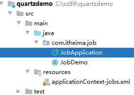

导入jar包

```xml
<?xml version="1.0" encoding="UTF-8"?>
<project xmlns="http://maven.apache.org/POM/4.0.0"
         xmlns:xsi="http://www.w3.org/2001/XMLSchema-instance"
         xsi:schemaLocation="http://maven.apache.org/POM/4.0.0 http://maven.apache.org/xsd/maven-4.0.0.xsd">
    <modelVersion>4.0.0</modelVersion>

    <groupId>com.itheima</groupId>
    <artifactId>quartzdemo</artifactId>
    <version>1.0-SNAPSHOT</version>

    <dependencies>
        <dependency>
            <groupId>org.springframework</groupId>
            <artifactId>spring-context-support</artifactId>
            <version>5.0.2.RELEASE</version>
        </dependency>
        <dependency>
            <groupId>org.springframework</groupId>
            <artifactId>spring-tx</artifactId>
            <version>5.0.2.RELEASE</version>
        </dependency>
        <dependency>
            <groupId>org.springframework</groupId>
            <artifactId>spring-web</artifactId>
            <version>5.0.2.RELEASE</version>
        </dependency>
        <dependency>
            <groupId>org.quartz-scheduler</groupId>
            <artifactId>quartz</artifactId>
            <version>2.2.1</version>
        </dependency>
        <dependency>
            <groupId>org.quartz-scheduler</groupId>
            <artifactId>quartz-jobs</artifactId>
            <version>2.2.1</version>
        </dependency>
    </dependencies>
</project>
```

 

（2）自定义一个Job

```java
package com.itheima.job;

import java.text.SimpleDateFormat;
import java.util.Date;

/**
 * Description: No Description
 * User: Eric
 */
public class JobDemo {
    SimpleDateFormat sdf = new SimpleDateFormat("yyyy-MM-dd HH:mm:ss");
    /**
     * 方法名可以随意
     */
    public void doJob(){
        System.out.println(sdf.format(new Date()));
    }
}

```

 

（3）提供Spring配置文件application-jobs.xml，配置自定义Job、任务描述、触发器、调度工厂等

【路径】

1：创建JobDetail对象,作用是负责通过反射调用指定的Job，注入目标对象，注入目标方法 

2：注册一个触发器，指定任务触发的时间 

3：注册一个统一的调度工厂，通过这个调度工厂调度任务

```xml
<?xml version="1.0" encoding="UTF-8"?>
<beans xmlns="http://www.springframework.org/schema/beans"
       xmlns:xsi="http://www.w3.org/2001/XMLSchema-instance"
       xsi:schemaLocation="http://www.springframework.org/schema/beans http://www.springframework.org/schema/beans/spring-beans.xsd">

<!--  注册任务类  -->
    <bean id="myJob" class="com.itheima.job.JobDemo"/>
<!--  任务策略类  -->
    <bean id="jobDetail" class="org.springframework.scheduling.quartz.MethodInvokingJobDetailFactoryBean">
<!--   targetObject 要调用哪个bean对象, 任务类对象     -->
        <property name="targetObject" ref="myJob"/>
<!--    调用任务类中的哪个方法     -->
        <property name="targetMethod" value="doJob"/>
<!--   并发 concurrent=false 单线程
       true: 在规定的周期内任务没完成时，又触发新的任务，属于同一任务时。使用多线程来处理任务
     -->
        <property name="concurrent" value="true"/>
    </bean>
<!--  触发器  -->
    <bean id="trigger" class="org.springframework.scheduling.quartz.CronTriggerFactoryBean">
<!--  从0秒开始，每间隔2秒触发一次
七子表达式 空格隔开
秒 分 时 日 月 周 年（省略，每年）
-->
        <property name="cronExpression" value="0/2 * * * * ?"/>
<!--  触发时使用的策略    -->
        <property name="jobDetail" ref="jobDetail"/>
    </bean>
<!--  调度容器  注册一个统一的调度工厂 -->
    <bean class="org.springframework.scheduling.quartz.SchedulerFactoryBean">
        <property name="triggers">
            <list>
                <ref bean="trigger"/>
            </list>
        </property>
    </bean>
</beans>
```

 

（4）创建启动类

```java
package com.itheima.job;

import org.springframework.context.support.ClassPathXmlApplicationContext;

import java.io.IOException;

/**
 * Description: No Description
 * User: Eric
 */
public class JobApplication {
    public static void main(String[] args) throws IOException {
        new ClassPathXmlApplicationContext("classpath:applicationContext-jobs.xml");
        // 阻塞
        System.in.read();
    }
}

```

 

执行上面main方法观察控制台，可以发现每隔2秒会输出一次，说明每隔2秒自定义Job被调用一次。

 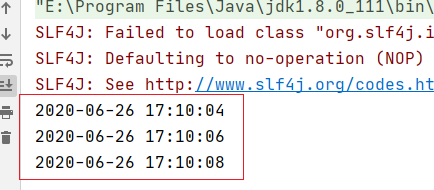 

## 1.3. **cron表达式**

上面的入门案例中我们指定了一个表达式：0/2 * * * * ? 

这种表达式称为cron表达式，通过cron表达式可以灵活的定义出符合要求的程序执行的时间。本小节我们就来学习一下cron表达式的使用方法。如下图：

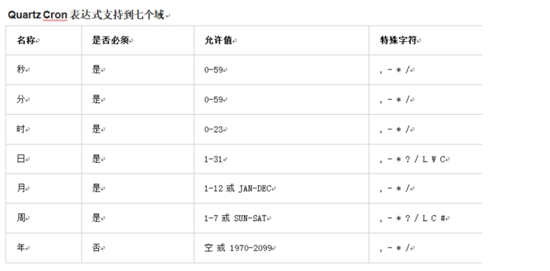 

cron表达式分为七个域，之间使用空格分隔。其中最后一个域（年）可以为空。每个域都有自己允许的值和一些特殊字符构成。使用这些特殊字符可以使我们定义的表达式更加灵活。

下面是对这些特殊字符的介绍：

逗号（,）：指定一个值列表，例如使用在月域上1,4,5,7表示1月、4月、5月和7月

横杠（-）：指定一个范围，例如在时域上3-6表示3点到6点（即3点、4点、5点、6点）

星号（*）：表示这个域上包含所有合法的值。例如，在月份域上使用星号意味着每个月都会触发

斜线（/）：表示递增，例如使用在秒域上0/15表示每15秒. 每间隔多长时间

问号（?）：只能用在日和周域上，但是不能在这两个域上同时使用。表示不指定， 表达式中必须存在一个? 要么在日上，要么在周上

井号（#）：只能使用在周域上，用于指定月份中的第几周的哪一天，例如6#3，意思是某月的第三个周五 (6=星期五，3意味着月份中的第三周) 星期天做为每周的第一天，1 代表星期天，2：星期一

母亲节: 0 0 8 ? 5 1#2  

L：某域上允许的最后一个值。只能使用在日和周域上。当用在日域上，表示的是在月域上指定的月份的最后一天。用于周域上时，表示周的最后一天，就是星期六

W：W 字符代表着工作日 (星期一到星期五)，只能用在日域上，它用来指定离指定日的最近的一个工作日

## 1.4. **cron表达式在线生成器**

前面介绍了cron表达式，但是自己编写表达式还是有一些困难的，我们可以借助一些cron表达式在线生成器来根据我们的需求生成表达式即可。

https://www.bejson.com/othertools/cron/

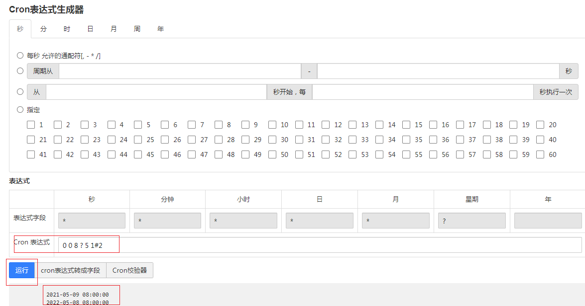 

### 【小结】

1：Quart介绍

- 掌握场景（后台定时任务）

2：Quartz入门案例

- 引入Quartz依赖, spring-context-support, spring-tx
- 创建任务类与方法
- spring配置文件：
  - 任务调度容器 SchedulerFactoryBean triggers
  - 触发器 CronTriggerFactoryBean, jobdetail
  - 任务策略 JobDetail, MethodInvokingJobDetailFactoryBean targetObject.targetMethod
  - 自定义的任务，要进入spring容器

3：cron表达式 七子表达式 秒 分 时 日 月 周 年

4：cron表达式在线生成器

<https://qqe2.com/cron >有问题

https://www.bejson.com/othertools/cron/ 可以用

# 2. 定时清理垃圾图片 【重在使用】

### 【目标】

Quartz整合项目，完成定时清理垃圾图片

### 【路径】

垃圾图片定义： 数据库上的图片就是要的，数据中没有的是不需要。图片是存到7牛上。

垃圾图片： 7牛上的减掉数据上的剩下的就是垃圾


希望后台自动运行，什么时候。 触发时机凌晨4点， 没有人来操作时，才能执行


1. 创建maven聚合工程health_jobs，打包方式为war(可以不为war)，导入Quartz等相关坐标

2. 创建ClearImgJob定时任务类

   * 配置redis spring-redis.xml


   * 清理7牛上的垃圾图片

3. 配置spring-job.xml, 使用spring整合quartz

   * 扫包 注册ClearImgJob任务对象 

   * 任务策略 jobDetail

   * 触发器 trigger

   * 调度容器Scheduler

4. web.xml

   启动spring容器

### 【讲解】

前面我们已经完成了体检套餐的管理，在新增套餐时套餐的基本信息和图片是分两次提交到后台进行操作的。也就是用户首先将图片上传到七牛云服务器，然后再提交新增窗口中录入的其他信息。如果用户只是上传了图片而没有提交录入的其他信息，此时的图片就变为了垃圾图片，因为在数据库中并没有记录它的存在。此时我们要如何处理这些垃圾图片呢？

解决方案就是通过定时任务组件定时清理这些垃圾图片。为了能够区分出来哪些图片是垃圾图片，我们在文件上传成功后将图片保存到了一个redis集合中，当套餐数据插入到数据库后我们又将图片名称保存到了另一个redis集合中，通过计算这两个集合的差值就可以获得所有垃圾图片的名称。

本章节我们就会基于Quartz定时任务，通过计算redis两个集合的差值找出所有的垃圾图片，就可以将垃圾图片清理掉。

## 2.1.  操作步骤

（1）创建maven聚合工程health_jobs，打包方式为war，导入Quartz等相关坐标

 

```xml
<?xml version="1.0" encoding="UTF-8"?>
<project xmlns="http://maven.apache.org/POM/4.0.0"
         xmlns:xsi="http://www.w3.org/2001/XMLSchema-instance"
         xsi:schemaLocation="http://maven.apache.org/POM/4.0.0 http://maven.apache.org/xsd/maven-4.0.0.xsd">
    <parent>
        <artifactId>health_parent</artifactId>
        <groupId>com.itheima</groupId>
        <version>1.0-SNAPSHOT</version>
    </parent>
    <modelVersion>4.0.0</modelVersion>

    <artifactId>health_jobs</artifactId>

    <packaging>war</packaging>
    <name>health_jobs Maven Webapp</name>
    <url>http://www.example.com</url>
    <properties>
        <project.build.sourceEncoding>UTF-8</project.build.sourceEncoding>
        <maven.compiler.source>1.8</maven.compiler.source>
        <maven.compiler.target>1.8</maven.compiler.target>
    </properties>
    <dependencies>
        <dependency>
            <groupId>com.itheima</groupId>
            <artifactId>health_interface</artifactId>
            <version>1.0-SNAPSHOT</version>
        </dependency>
        <dependency>
            <groupId>org.quartz-scheduler</groupId>
            <artifactId>quartz</artifactId>
        </dependency>
        <dependency>
            <groupId>org.quartz-scheduler</groupId>
            <artifactId>quartz-jobs</artifactId>
        </dependency>
    </dependencies>
</project>
```

 

（2）配置web.xml

```xml
<?xml version="1.0" encoding="UTF-8"?>
<web-app xmlns:xsi="http://www.w3.org/2001/XMLSchema-instance"
         xmlns="http://java.sun.com/xml/ns/javaee"
         xsi:schemaLocation="http://java.sun.com/xml/ns/javaee http://java.sun.com/xml/ns/javaee/web-app_3_0.xsd"
         id="WebApp_ID" version="3.0">
    <display-name>Archetype Created Web Application</display-name>
    <!-- 加载spring容器 -->
    <context-param>
        <param-name>contextConfigLocation</param-name>
        <param-value>classpath:applicationContext-*.xml</param-value>
    </context-param>
    <listener>
        <listener-class>org.springframework.web.context.ContextLoaderListener</listener-class>
    </listener>
</web-app>
```

 

（3）配置log4j.properties

```properties
### direct log messages to stdout ###
log4j.appender.stdout=org.apache.log4j.ConsoleAppender
log4j.appender.stdout.Target=System.err
log4j.appender.stdout.layout=org.apache.log4j.PatternLayout
log4j.appender.stdout.layout.ConversionPattern=%d{ABSOLUTE} %5p %c{1}:%L - %m%n

### direct messages to file mylog.log ###
log4j.appender.file=org.apache.log4j.FileAppender
log4j.appender.file.File=c:\\mylog.log
log4j.appender.file.layout=org.apache.log4j.PatternLayout
log4j.appender.file.layout.ConversionPattern=%d{ABSOLUTE} %5p %c{1}:%L - %m%n

### set log levels - for more verbose logging change 'info' to 'debug' ###

log4j.rootLogger=debug, stdout
```

 

（4）配置applicationContext-redis.xml

```xml
<?xml version="1.0" encoding="UTF-8"?>
<beans xmlns="http://www.springframework.org/schema/beans"
       xmlns:xsi="http://www.w3.org/2001/XMLSchema-instance"
       xsi:schemaLocation="http://www.springframework.org/schema/beans http://www.springframework.org/schema/beans/spring-beans.xsd ">

    <!--Jedis连接池的相关配置-->
    <bean id="jedisPoolConfig" class="redis.clients.jedis.JedisPoolConfig">
        <property name="maxTotal">
            <value>200</value>
        </property>
        <property name="maxIdle">
            <value>50</value>
        </property>
<!--   testOnBorrow   从连接池获取连接对象时，要测试一下，验证能否使用，如果不能使用，重新获取，重新创建连接   -->
        <property name="testOnBorrow" value="true"/>
<!--   testOnReturn   还回连接池时，要测试一下，验证能否使用-->
        <property name="testOnReturn" value="true"/>
    </bean>
    <bean id="jedisPool" class="redis.clients.jedis.JedisPool">
        <constructor-arg name="poolConfig" ref="jedisPoolConfig" />
        <constructor-arg name="host" value="127.0.0.1" />
        <constructor-arg name="port" value="6379" type="int" />
        <constructor-arg name="timeout" value="30000" type="int" />
    </bean>
</beans>
```

 

（5）配置applicationContext-jobs.xml

```xml
<?xml version="1.0" encoding="UTF-8"?>
<beans xmlns="http://www.springframework.org/schema/beans"
       xmlns:xsi="http://www.w3.org/2001/XMLSchema-instance"
       xmlns:context="http://www.springframework.org/schema/context"
       xsi:schemaLocation="http://www.springframework.org/schema/beans http://www.springframework.org/schema/beans/spring-beans.xsd http://www.springframework.org/schema/context http://www.springframework.org/schema/context/spring-context.xsd">

    <!--  自定义的类 注册到spring容器  -->
    <context:component-scan base-package="com.itheima.health.job"/>

<!--  任务策略  -->
    <bean id="jobDetail" class="org.springframework.scheduling.quartz.MethodInvokingJobDetailFactoryBean">
        <property name="targetObject" ref="clearImgJob"/>
        <property name="targetMethod" value="clearImg"/>
    </bean>
<!--  触发器  -->
    <bean id="trigger" class="org.springframework.scheduling.quartz.CronTriggerFactoryBean">
<!--  测试      <property name="cronExpression" value="0/30 * * * * ?"/>-->
        <property name="cronExpression" value="0 0 4 * * ?"/>
        <property name="jobDetail" ref="jobDetail"/>
    </bean>
<!--  调度容器  -->
    <bean class="org.springframework.scheduling.quartz.SchedulerFactoryBean">
        <property name="triggers">
            <list>
                <ref bean="trigger"/>
            </list>
        </property>
    </bean>
</beans>
```

 

（6）创建ClearImgJob定时任务类

```java
package com.itheima.health.job;

import com.itheima.health.constant.RedisConstant;
import com.itheima.health.utils.QiNiuUtils;
import org.springframework.beans.factory.annotation.Autowired;
import org.springframework.stereotype.Component;
import redis.clients.jedis.Jedis;
import redis.clients.jedis.JedisPool;

import java.util.Set;

/**
 * Description: 清理垃圾图片 任务类
 * User: Eric
 *
 * Component   通过注解方法注册到spring容器中，如果没指定name属性，则默认用类名 首字母小写
 * Controller
 * Service
 * Repository
 */
@Component
public class ClearImgJob {

    @Autowired
    private JedisPool jedisPool;

    /**
     * 清理垃圾图片的执行方法
     */
    public void clearImg(){
        // 获取 redis的连接
        Jedis jedis = jedisPool.getResource();
        // 计算2个set集合的差集 所有七牛图片-保存到数据库
        // 需要删除的图片
        Set<String> need2Delete = jedis.sdiff(RedisConstant.SETMEAL_PIC_RESOURCES, RedisConstant.SETMEAL_PIC_DB_RESOURCES);
        // 调用七牛删除
        QiNiuUtils.removeFiles(need2Delete.toArray(new String[]{}));
        // 删除redis上的图片, 两边的图片已经同步了
        jedis.del(RedisConstant.SETMEAL_PIC_RESOURCES, RedisConstant.SETMEAL_PIC_DB_RESOURCES);
    }
}

```

测试： 

控制台输出 “delete success” 代表成功 

## 2.2 另外一种实现（七牛-数据库）

### 2.2.1 遍历7牛上的图片

修改QiNiuUitls，添加遍历7牛上图片的方法

```java
    /**
     * 遍历7牛上的所有图片
     * @return
     */
    public static List<String> listFile(){
        BucketManager bucketManager = getBucketManager();
        //列举空间文件列表, 第一个参数：图片的仓库（空间名）,第二个参数，文件名前缀过滤。“”代理所有
        BucketManager.FileListIterator fileListIterator = bucketManager.createFileListIterator(BUCKET,"");
        List<String> imageFiles = new ArrayList<String>();
        while (fileListIterator.hasNext()) {
            //处理获取的file list结果
            FileInfo[] items = fileListIterator.next();
            for (FileInfo item : items) {
                // item.key 文件名
                imageFiles.add(item.key);
                System.out.println(item.key);
            }
        }
        return imageFiles;
    }
```

### 2.2.2 修改依赖

修改health_jobs的pom.xml，添加对health_interface的依赖

```xml
<dependencies>
    <dependency>
        <groupId>com.itheima</groupId>
        <artifactId>health_interface</artifactId>
        <version>1.0-SNAPSHOT</version>
    </dependency>
    <dependency>
        <groupId>org.quartz-scheduler</groupId>
        <artifactId>quartz</artifactId>
    </dependency>
    <dependency>
        <groupId>org.quartz-scheduler</groupId>
        <artifactId>quartz-jobs</artifactId>
    </dependency>
</dependencies>
```

### 2.2.3 spring-jobs.xml配置

```xml
<?xml version="1.0" encoding="UTF-8"?>
<beans xmlns="http://www.springframework.org/schema/beans"
       xmlns:xsi="http://www.w3.org/2001/XMLSchema-instance" xmlns:dubbo="http://code.alibabatech.com/schema/dubbo"
       xsi:schemaLocation="http://www.springframework.org/schema/beans http://www.springframework.org/schema/beans/spring-beans.xsd http://code.alibabatech.com/schema/dubbo http://code.alibabatech.com/schema/dubbo/dubbo.xsd">

    <!-- 指定应用名称 -->
    <dubbo:application name="health_job" />
    <!--指定服务注册中心地址-->
    <dubbo:registry address="zookeeper://127.0.0.1:2181"/>
<!-- 任务类要注册 使用dubbo 扫包  -->
    <dubbo:annotation package="com.itheima.health.job"/>

<!--  策略  -->
    <bean id="jobDetail" class="org.springframework.scheduling.quartz.MethodInvokingJobDetailFactoryBean">
        <property name="targetObject" ref="cleanImgJob"/>
        <property name="targetMethod" value="cleanImg"/>
<!--concurrent为true时，多线程来跑任务 异步
    false: 则为单线程来跑任务 同步
-->
        <property name="concurrent" value="false"/>
    </bean>
<!--  触发器  -->
    <bean id="trigger" class="org.springframework.scheduling.quartz.CronTriggerFactoryBean">
        <property name="cronExpression" value="0/30 * * * * ?"/>
        <property name="jobDetail" ref="jobDetail"/>
    </bean>
<!--  调度容器  -->
    <!--  调度容器  -->
    <bean class="org.springframework.scheduling.quartz.SchedulerFactoryBean">
        <property name="triggers">
            <list>
                <ref bean="trigger"/>
            </list>
        </property>
    </bean>
</beans>
```

### 2.2.4 SetmealService与实现类

SetmealService接口

```java
/**
 * 查出数据库中的所有图片
 * @return
 */
List<String> findImgs();
```

SetmealServiceImpl实现类

```java
/**
 * 查出数据库中的所有图片
 * @return
 */
@Override
public List<String> findImgs() {
    return setmealDao.findImgs();
}
```


### 2.2.5 SetmealDao与映射文件

SetmealDao添加查询所有套餐图片方法

```java
/**
 * 查数据中套餐的所有图片
 * @return
 */
List<String> findImgs();
```

SetmealDao.xml映射文件

```xml
<select id="findImgs" resultType="String">
    select img from t_setmeal
</select>
```

### 2.2.6 清理垃圾图片任务类

```java
package com.itheima.health.job;

import com.alibaba.dubbo.config.annotation.Reference;
import com.itheima.health.service.SetmealService;
import com.itheima.health.utils.QiNiuUtils;
import org.springframework.stereotype.Component;

import java.util.List;

/**
 * Description: No Description
 * User: Eric
 */
@Component("cleanImgJob")
public class CleanImgJob {

    /**
     * 订阅服务
     */
    @Reference
    private SetmealService setmealService;

    public void cleanImg(){
        // 查出7牛上的所有图片
        List<String> imgIn7Niu = QiNiuUtils.listFile();
        // 查出数据库中的所有图片
        List<String> imgInDb = setmealService.findImgs();
        // 7牛的-数据库的 imgIn7Niu剩下的就是要删除的
        // imgIn7Niu.size(7) - 3 = imgIn7Niu.size(4)
        // imgInDb里的对象在 imgIn7Niu 能找到就把这删除
        imgIn7Niu.removeAll(imgInDb);
        // 删除7牛上的垃圾图片
        String[] strings = imgIn7Niu.toArray(new String[]{});
        QiNiuUtils.removeFiles(strings);
    }
}

```


### 【小结】

1. Quartz的应用场景：后台任务（半夜执行任务）

2. 组件及执行过程：任务调度容器->触发器->任务策略（并发=false）->任务类->任务方法

3. Redis中的Set集合操作：

   sadd 添加， smembers key 查看集合中的所有元素, srem 删除集合中的元素，sdiff key1 key2计算key1-key2的集合

4. 7牛保存所有的图片-保存到数据库的图片=要清理的集合

5. 启动的方式：只要能启动spring容器即可


# 3. 预约设置需求分析

### 【目标】

- 掌握预约设置的需求

### 【路径】

1. 预约设置需求分析
2. 对应的表结构和实体类

### 【讲解】

## 3.1. 预约设置需求分析

前面我们已经完成了检查项管理、检查组管理、套餐管理等。接下来我们需要进行预约设置，其实就是设置每一天的体检预约最大数量。客户可以通过微信端在线预约，在线预约时需要选择体检的时间，使得选择体检时间的已预约人数加1，如果客户选择的时间已经预约满则无法进行预约。

## 3.2. t_ordersetting表结构

 

orderDate：预约日期 

number：最多可预约人数 

reservations：已预约人数

### 【小结】

1. 预约设置 就是设置一天最大预约体检人数（number字段）

2. 客户预约的时候，判断是否可预约(reservations<number)，需要更新当前预约人数+1（reservations字段）

   防止超卖

3. 已预约人数不能大于可预约人数(reservations<=number)

4. 为什么要做预约设置：用户体验（人多，等时间长，体验差），成本管控（节假日，工作人员空缺）

# 4. **Apache POI**

### 【目标】

了解什么是Apache POI

掌握Apache POI的使用方法

### 【路径】

1. POI介绍

2. POI入门案例

   （1）从Excel文件读取数据

   （2）向Excel文件写入数据

3. POI工具类的介绍

### 【讲解】

## 4.1. **POI介绍**

Apache POI是用Java编写的免费开源的跨平台的Java API，Apache POI提供API给Java程序对Microsoft Office格式档案读和写的功能，其中使用最多的就是使用POI操作Excel文件。

jxl：专门操作Excel

maven坐标：

```xml
<dependency>
  <groupId>org.apache.poi</groupId>
  <artifactId>poi</artifactId>
  <version>3.14</version>
</dependency>
<dependency>
  <groupId>org.apache.poi</groupId>
  <artifactId>poi-ooxml</artifactId>
  <version>3.14</version>
</dependency>
```

POI结构的组件：

```java
HSSF － 提供读写Microsoft Excel XLS格式档案的功能 97-2003的excel, 后缀名.xls 工作表大行号65535
XSSF － 提供读写Microsoft Excel OOXML XLSX格式档案的功能（我们使用） 2007以后.xlsx 工作表大行号1,048,576
HWPF － 提供读写Microsoft Word DOC格式档案的功能
HSLF － 提供读写Microsoft PowerPoint格式档案的功能
HDGF － 提供读Microsoft Visio格式档案的功能
HPBF － 提供读Microsoft Publisher格式档案的功能
HSMF － 提供读Microsoft Outlook格式档案的功能
```

我们使用：XSSF － 提供读写Microsoft Excel OOXML XLSX格式档案的功能

## 4.2. **入门案例** 【重点】

### 4.2.1. **从Excel文件读取数据**

【需求】

使用POI可以从一个已经存在的Excel文件中读取数据

【路径】

1：创建工作簿对象

2：获得工作表对象 传文件所在

3：遍历工作表对象 获得行对象

4：遍历行对象 获得单元格（列）对象

5：获得数据

6：关闭

【讲解】

1. 实现

使用POI可以从一个已经存在的Excel文件中读取数据

创建poidemo工程

 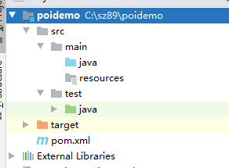

pom.xml中添加依赖

```xml
<dependencies>
    <dependency>
        <groupId>org.apache.poi</groupId>
        <artifactId>poi</artifactId>
        <version>3.14</version>
    </dependency>
    <dependency>
        <groupId>org.apache.poi</groupId>
        <artifactId>poi-ooxml</artifactId>
        <version>3.14</version>
    </dependency>
    <dependency>
        <groupId>junit</groupId>
        <artifactId>junit</artifactId>
        <version>4.12</version>
        <scope>test</scope>
    </dependency>
</dependencies>
```

把资料中的read.xlsx复制到D盘根目录下

创建读取excel测试类

```java
package com.itheima.test;

import org.apache.poi.hssf.usermodel.HSSFWorkbook;
import org.apache.poi.ss.usermodel.Cell;
import org.apache.poi.ss.usermodel.Row;
import org.apache.poi.ss.usermodel.Sheet;
import org.apache.poi.ss.usermodel.Workbook;
import org.apache.poi.xssf.usermodel.XSSFWorkbook;
import org.junit.Test;

import java.io.IOException;

/**
 * Description: No Description
 * User: Eric
 */
public class ReadFormExcel {
    @Test
    public void readFromExcel() throws Exception {
        // 创建工作簿, 构造方法文件路径
        Workbook workbook = new XSSFWorkbook("d:\\read.xlsx");
        // 获取工作表
        Sheet sht = workbook.getSheetAt(0);
        // sht.getPhysicalNumberOfRows(); // 物理行数
        // sht.getLastRowNum(); // 最后一行的下标
        // fori遍历时使用getLastrowNum()
        // 遍历工作表获得行对象
        for (Row row : sht) {
            // 遍布行对象获取单元格
            for (Cell cell : row) {
                // 单元格的类型
                int cellType = cell.getCellType();
                if(Cell.CELL_TYPE_NUMERIC == cellType){
                    // 数值类型的单元格
                    System.out.print(cell.getNumericCellValue() + ",");
                }else {
                    // 从单元格取值
                    System.out.print(cell.getStringCellValue() + ",");
                }
            }
            System.out.println();
        }
        // 关闭工作簿
        workbook.close();
    }
}
```

通过上面的入门案例可以看到，POI操作Excel表格封装了几个核心对象：

```
XSSFWorkbook：工作簿
XSSFSheet：工作表
XSSFRow：行
XSSFCell：单元格
```

上面案例是通过遍历工作表获得行，遍历行获得单元格，最终获取单元格中的值。

还有一种方式就是获取工作表最后一个行号，从而根据行号获得行对象，通过行获取最后一个单元格索引，从而根据单元格索引获取每行的一个单元格对象，代码如下：

```java
// 导出excel，获取最后一行
@Test
public void exportExcel_lastRow() throws IOException {
    //创建工作簿
    XSSFWorkbook workbook = new XSSFWorkbook("d:\\read.xlsx");
    //获取工作表，既可以根据工作表的顺序获取，也可以根据工作表的名称获取
    XSSFSheet sheet = workbook.getSheetAt(0);
    //获取当前工作表最后一行的行号，行号从0开始
    int lastRowNum = sheet.getLastRowNum();
    for(int i=0;i<=lastRowNum;i++){
        //根据行号获取行对象
        XSSFRow row = sheet.getRow(i);
        short lastCellNum = row.getLastCellNum();
        for(short j=0;j<lastCellNum;j++){
            String value = row.getCell(j).getStringCellValue();
            System.out.println(value);
        }
    }
    workbook.close();
}
```

 

### 4.2.2. **向Excel文件写入数据**

【需求】

 使用POI可以在内存中创建一个Excel文件并将数据写入到这个文件，最后通过输出流将内存中的Excel文件保存到磁盘

【路径】

```
1.创建工作簿对象
2.创建工作表对象
3.创建行对象
4.创建列(单元格)对象, 设置内容
5.通过输出流将workbook对象下载到磁盘
```

【实现】

使用POI可以在内存中创建一个Excel文件并将数据写入到这个文件，最后通过输出流将内存中的Excel文件保存到磁盘

```java
package com.itheima.test;

import org.apache.poi.ss.usermodel.Cell;
import org.apache.poi.ss.usermodel.Row;
import org.apache.poi.ss.usermodel.Sheet;
import org.apache.poi.ss.usermodel.Workbook;
import org.apache.poi.xssf.usermodel.XSSFWorkbook;
import org.junit.Test;

import java.io.File;
import java.io.FileNotFoundException;
import java.io.FileOutputStream;

/**
 * Description: No Description
 * User: Eric
 */
public class WriteExcel {

    @Test
    public void createExcel() throws Exception {
        // 创建工作簿，内存中
        Workbook workbook = new XSSFWorkbook();
        // 创建工作表
        Sheet sht = workbook.createSheet("测试写excel");
        // 在工作表下创建行
        Row row = sht.createRow(0);// 行的下标是从0开始
        // 使用行创建单元格
        Cell cell = row.createCell(0);// 单元格的下标也是从0开始, 多个单元格合并后成为1个单元格
        // 给单元格赋值
        // 表头
        cell.setCellValue("姓名");
        row.createCell(1).setCellValue("年龄");
        row.createCell(2).setCellValue("所在地");

        row = sht.createRow(1);
        row.createCell(0).setCellValue("小明");
        row.createCell(1).setCellValue(20);
        row.createCell(2).setCellValue("北京");

        row = sht.createRow(2);
        row.createCell(0).setCellValue("小李");
        row.createCell(1).setCellValue(30);
        row.createCell(2).setCellValue("南京");
        // 保存工作簿，持久化本地硬盘里
        workbook.write(new FileOutputStream(new File("d:\\createExcel.xlsx")));
        // 关闭工作簿
        workbook.close();
    }
}

```

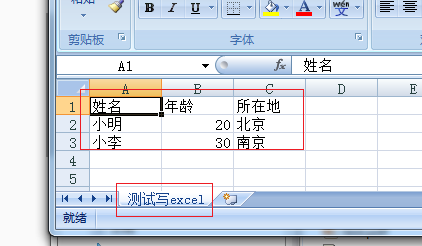 

小结：POI技术（向Excel文件写入数据）

- 创建工作簿的时候, 不需要传入参数(excel不存在的)
- 使用输出流，输出excel

应用场景：1：从excel中读取数据，写入到数据库（导入）；2：从数据库查询数据，写入到excel文件（报表技术，导出）

### 4.2.3.POI工具类的介绍

将资料中的POIUtils工具类复制到health_common工程

 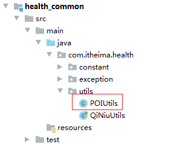 

修改日期格式的常量修饰符，改为public

 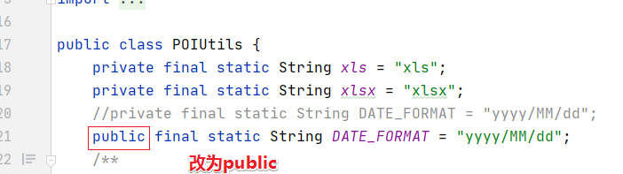

### 【小结】

1. POI apache开源的来操作offices 文档， excel (xls2003 HSSFWorkbook  xlsx2007 XSSFWorkbook)

2. 入门
  
   * 读取excel
     * 创建工作簿，构造方法传文件的全路径
     * 获取工作表
     * 获取行对象，工作表遍历获取行对象
     * 通过行对象的遍历获取单元格
     * 通过单元格获取单元格的值，跟单元格的类型，如果是数值，就得用getNumbericCellValue
     * 关闭工作簿
   * 写excel
     * 创建工作簿，无参构造
     * 创建工作表, 通过下标也可通过名称
     * 创建行 下标从0开始
     * 行对象下创建单元格，从0开始
     * 对单元格赋值
     * 保存工作簿 write到输出流
     * 关闭工作簿
   
   3. POIUtils, 读取上传的excel文件，读取后的值 为List<String[]> String[]代表一行记录

# 5. **批量导入预约设置信息** 【重点】

### 【目标】

批量导入预约设置信息

### 【路径】

1. 提供模板文件下载
   
* health_web的webapp下创建template目录，把资料中的""预约设置模板文件\ordersetting_template.xlsx\" 复制到template目录下
   
2. 上传文件 导入

   * OrderSettingController 接收上传的文件
     * 调用POIUtils解析excel文件，List<String[]>
     * 把List<String[]> 转成List<OrderSetting> 调用服务端
     * 返回结果给页面
   
   * OrderSettingService
   
     * 遍历循环List<OrderSetting>
   
     * 通过日期判断是否存在预约设置信息
   
       * 存在
         * 判断已预约人数是否大于 要更新的 可预约人数
         * 大于 则报错
         * 小于 则更新可预约数
   
       * 不存在，则插入预约设置
   
   * OrderSettingDao
     * 通过日期查询预约设置
     * 更新可预约数
     * 插入预约设置

### 【讲解】

【需求】

从Excel读取预约设置的数据，批量导入到数据库

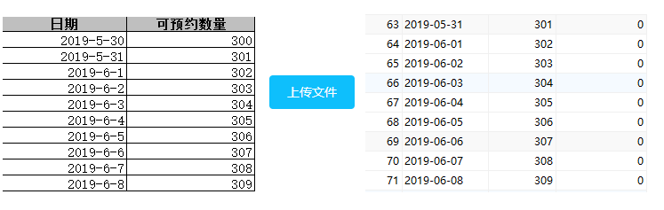

【设计】

预约设置信息对应的数据表为t_ordersetting，预约设置操作对应的页面为ordersetting.html

1：t_ordersetting表结构：

 

orderDate：预约日期 

number：最多可预约人数 

reservations：已预约人数

【路径】

批量导入预约设置信息操作过程：

​	第一步、点击模板下载按钮下载Excel模板文件【文件下载】

​	第二步、将预约设置信息录入到模板文件中

​	第三步、点击上传文件按钮将录入完信息的模板文件上传到服务器【文件上传】

​	第四步、通过POI读取上传文件的数据并保存到数据库【poi导入】

2：将ordersetting.html放置到health_web中

 

## 5.1. **前台代码**

### 5.1.1. **提供模板文件**

资料中已经提供了Excel模板文件ordersetting_template.xlsx，将文件放在health_web工程的template目录下

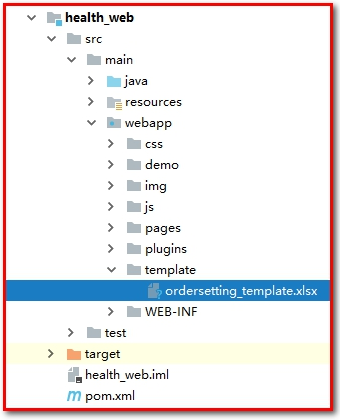 

### 5.1.2. 实现模板文件下载-已实现

（1）为模板下载按钮绑定事件实现模板文件下载 

```html
<el-button style="margin-bottom: 20px;margin-right: 20px" type="primary" @click="downloadTemplate()">模板下载</el-button>
```

（2）downloadTemplate()

```javascript
//下载模板文件
downloadTemplate(){
    window.location.href="../../template/ordersetting_template.xlsx";
},
```


### 5.1.3. 文件上传 - 前端已实现

（1）使用ElementUI的上传组件实现文件上传并绑定相关事件

```html
<el-upload action="/ordersetting/upload.do"
           name="excelFile"
           :show-file-list="false"
           :on-success="handleSuccess"
           :before-upload="beforeUpload">
    <el-button type="primary">上传文件</el-button>
</el-upload>
```

（2）handleSuccess方法：用于显示上传成功或者失败信息。

```javascript
//上传成功提示
handleSuccess(response, file) {
    if(response.flag){
         this.$message({
              message: response.message,
              type: 'success'
         });
    }else{
         this.$message.error(response.message);
    }
},
```

 

（3）methods中的beforeUpload方法：用于校验上传的文件是否是excel文件

```javascript
//上传之前进行文件格式校验
beforeUpload(file) {
    // file.type指的是文件的类型，
    // 部分同学可以得不到application/vnd.ms-excel application/vnd.openxmlformats-officedocument.spreadsheetml.sheet
    // 这是跟系统有关的，可以使用判断文件的后缀名方式来替换下面的文件类型校验

    // var fileExt = file.name.substring(file.name.lastIndexOf("."));
    // if (fileExt==".xls" || fileExt==".xlsx"){
             //return true;
    //}
    const isXLS = file.type === 'application/vnd.ms-excel';
    if(isXLS){
        return true;
    }
    const isXLSX = file.type === 'application/vnd.openxmlformats-officedocument.spreadsheetml.sheet';
    if (isXLSX) {
        return true;
    }
    this.$message.error('上传文件只能是xls或者xlsx格式!');
    return false;
},
```


## 5.2. **后台代码**

### 5.2.1. **Controller**

在health_web工程创建OrderSettingController并提供upload方法

```java
package com.itheima.health.controller;

import com.alibaba.dubbo.config.annotation.Reference;
import com.itheima.health.constant.MessageConstant;
import com.itheima.health.entity.Result;
import com.itheima.health.pojo.OrderSetting;
import com.itheima.health.service.OrderSettingService;
import com.itheima.health.utils.POIUtils;
import org.springframework.web.bind.annotation.PostMapping;
import org.springframework.web.bind.annotation.RequestMapping;
import org.springframework.web.bind.annotation.RestController;
import org.springframework.web.multipart.MultipartFile;

import java.io.IOException;
import java.text.SimpleDateFormat;
import java.util.ArrayList;
import java.util.Date;
import java.util.List;

@RestController
@RequestMapping("/ordersetting")
public class OrderSettingController {

    @Reference
    private OrderSettingService orderSettingService;

    // 上传excel文件
    @PostMapping("/upload")
    public Result upload(MultipartFile excelFile){
        try {
            // 读取excel内容
            List<String[]> strings = POIUtils.readExcel(excelFile);
            // 转成List<OrderSetting>
            List<OrderSetting> orderSettingList = new ArrayList<OrderSetting>();
            // 日期格式解析
            SimpleDateFormat sdf = new SimpleDateFormat(POIUtils.DATE_FORMAT);
            Date orderDate = null;
            OrderSetting os = null;
            for (String[] dataArr : strings) {
                orderDate = sdf.parse(dataArr[0]);
                int number = Integer.valueOf(dataArr[1]);
                os = new OrderSetting(orderDate,number);
                orderSettingList.add(os);
            }
            // 调用业务服务
            orderSettingService.add(orderSettingList);
            return new Result(true, MessageConstant.IMPORT_ORDERSETTING_SUCCESS);
        } catch (Exception e) {
            e.printStackTrace();
            return new Result(false, MessageConstant.IMPORT_ORDERSETTING_FAIL);
        }
    }
}

```

 

### 5.2.2. **服务接口**

创建OrderSettingService服务接口并提供新增方法

```java
package com.itheima.health.service;

import com.itheima.health.exception.HealthException;
import com.itheima.health.pojo.OrderSetting;

import java.util.List;

/**
 * Description: No Description
 * User: Eric
 */
public interface OrderSettingService {
    /**
     * 批量导入
     * @param orderSettingList
     */
    void add(List<OrderSetting> orderSettingList) throws HealthException;
}

```

 

### 5.2.3. **服务实现类**

创建服务实现类OrderSettingServiceImpl并实现新增方法

```java
package com.itheima.health.service.impl;

import com.alibaba.dubbo.config.annotation.Service;
import com.itheima.health.dao.OrderSettingDao;
import com.itheima.health.exception.HealthException;
import com.itheima.health.pojo.OrderSetting;
import com.itheima.health.service.OrderSettingService;
import org.springframework.beans.factory.annotation.Autowired;
import org.springframework.transaction.annotation.Transactional;

import java.util.List;

/**
 * Description: No Description
 * User: Eric
 */
@Service(interfaceClass = OrderSettingService.class)
public class OrderSettingServiceImpl implements OrderSettingService {

    @Autowired
    private OrderSettingDao orderSettingDao;

    @Override
    @Transactional
    public void add(List<OrderSetting> orderSettingList) {
        // 遍历
        for (OrderSetting orderSetting : orderSettingList) {
            // 判断是否存在, 通过日期来查询, 注意：日期里是否有时分秒，数据库里的日期是没有时分秒的
            OrderSetting osInDB = orderSettingDao.findByOrderDate(orderSetting.getOrderDate());
            if(null != osInDB){
                // 数据库存在这个预约设置, 已预约数量不能大于可预约数量
                if(osInDB.getReservations() > orderSetting.getNumber()){
                    throw new HealthException(orderSetting.getOrderDate() + " 中已预约数量不能大于可预约数量");
                }
                orderSettingDao.updateNumber(orderSetting);
            }else{
                // 不存在
                orderSettingDao.add(orderSetting);
            }
        }
    }
}

```

 

### 5.2.4. **Dao接口**

创建Dao接口OrderSettingDao并提供更新和新增方法

```java
package com.itheima.health.dao;

import com.itheima.health.pojo.OrderSetting;

import java.util.Date;

/**
 * Description: No Description
 * User: Eric
 */
public interface OrderSettingDao {
    /**
     * 通过日期来查询预约设置
     * @param orderDate
     * @return
     */
    OrderSetting findByOrderDate(Date orderDate);

    /**
     * 更新可预约数量
     * @param orderSetting
     */
    void updateNumber(OrderSetting orderSetting);

    /**
     * 添加预约设置
     * @param orderSetting
     */
    void add(OrderSetting orderSetting);
}

```

 

### 5.2.5. **Mapper映射文件**

创建Mapper映射文件OrderSettingDao.xml并提供相关SQL

```xml
<?xml version="1.0" encoding="UTF-8" ?>
<!DOCTYPE mapper
        PUBLIC "-//mybatis.org//DTD Mapper 3.0//EN"
        "http://mybatis.org/dtd/mybatis-3-mapper.dtd">

<mapper namespace="com.itheima.health.dao.OrderSettingDao">

    <select id="findByOrderDate" parameterType="date" resultType="OrderSetting">
        select * From t_orderSetting where orderDate = #{orderDate}
    </select>

    <update id="updateNumber" parameterType="OrderSetting">
        update t_ordersetting set number=#{number} where orderDate = #{orderDate}
    </update>

    <insert id="add" parameterType="ordersetting">
        insert into t_ordersetting (orderDate,number,reservations)
        values(#{orderDate},#{number}, #{reservations})
    </insert>
</mapper>
```

查看t_ordersetting表

 

### 【小结】

1：前台代码

（1）提供模板文件  严格要求用户的行为，因此导入的数据会进入数据库，如果数据有问题，将功能受影响

​	日期 yyyy/MM/dd 

（2）实现模板文件下载, 要下载的文件放到相应webapp/template的目录，添加下载的链接

（3）文件上传

2：后台代码

业务：

（1）OrderSettingController.java（Controller）

从excel中读取预约设置信息转成List<ordersetting>，批量导入到数据库

（2）OrderSettingService.java（服务接口）

（3）OrderSettingServiceImpl.java（服务实现类）

1. 如果这个日期的预约信息不存存就直接插入即可以
2. 如果存在预约设置信息，通过日期查询预约设置
   * 存在 判断已预约人数是否大于要更改的最大预约数
   * 大于则抛出异常
   * 小于或等于，则更新最大预约数

（4）OrderSettingDao.java（Dao接口）

添加的方法，通过日期查询，通过日期更新最大预约数量

（5）OrderSettingDao.xml（Mapper映射文件）

添加的方法，通过日期查询，通过日期更新最大预约数量

mysql8 的同学 where orderDate=#{orderDate,jdbcType=DATE}

# 6. **日历展示预约设置信息** 【重点】

### 【目标】

日历展示预约设置信息

### 【路径】

1：前台代码

（1）使用静态数据调试 把 ordersetting.html页面中的initData方法中的leftobj注释去掉，刷新页面

​	发送请求获取当前月份(yyyy-MM)的数据，获得数据绑定this.leftobj

​	前端需要的数据来源 t_ordersetting表，但数据格式是[]->list, {date,number,reservations}->java 没有实体但可以用map替代, controller需要返回List<Map<String,Integer>>


（2）页面加载时，获取当前的月份，再发送ajax获取动态数据， 把返回的数据绑定到leftObj

2：后台代码

业务：

- 在页面上，使用日历展示预约设置信息

（1）OrderSettingController.java（Controller）

接收月份日期，调用服务, 返回结果 (yyyy-MM)

（2）OrderSettingService.java（服务接口）

（3）OrderSettingServiceImpl.java（服务实现类）

拼接开始日期-1，结束日期-32，调用dao查询，返回给controller

（4）OrderSettingDao.java（Dao接口）

通过日期范围查询预约设置信息

（5）OrderSettingDao.xml（Mapper映射文件）

```sql
select cast(DATE_FORMAT(ORDERDATE,'%d') as SIGNED) date,
	number,reservations 
from t_ordersetting 
where orderDate between #{startDate} and #{endDate}
```

3：初始化下个月，上个月数据

### 【讲解】

【需求】

前面已经完成了预约设置功能，现在就需要通过日历的方式展示出来每天设置的预约人数。

在页面中已经完成了日历的动态展示，我们只需要查询当前月份的预约设置信息并展示到日历中即可，同时在日历中还需要展示已经预约的人数，效果如下：

 

## 6.1. **前台代码**

### 6.1.1. **使用静态数据调试**

为了能够快速看到效果，我们可以先使用静态数据模拟，然后再改为发送ajax请求查询数据库。

实现步骤：

（1）预约设置数据对应的模型数据为leftobj，在initData方法最后为leftobj模型数据赋值：

```javascript
this.leftobj = [
    { date: 1, number: 120, reservations: 1 },
    { date: 3, number: 120, reservations: 1 },
    { date: 4, number: 120, reservations: 120 },
    { date: 6, number: 120, reservations: 1 },
    { date: 8, number: 120, reservations: 1 }
];
```

 

其中date表示日期，number表示可预约人数，reservations表示已预约人数

（2）使用VUE的v-for标签遍历上面的leftobj模型数据，展示到日历上：

```html
<template>
    <template v-for="obj in leftobj">
        <template v-if="obj.date  dayobject.day.getDate()">
            <template v-if="obj.number > obj.reservations">
                <div class="usual">
                     <p>可预约{{obj.number}}人</p>
                     <p>已预约{{obj.reservations}}人</p>
                </div>
            </template>
            <template v-else>
                <div class="fulled">
                    <p>可预约{{obj.number}}人</p>
                    <p>已预约{{obj.reservations}}人</p>
                    <p>已满</p>
                </div>
            </template>
        </template>
    </template>
    <button v-if="dayobject.day > today" @click="handleOrderSet(dayobject.day)" class="orderbtn">设置</button>
</template>
```

 

 

### 6.1.2. **发送ajax获取动态数据**

将上面的静态模拟数据去掉，改为发送ajax请求，根据当前页面对应的月份查询数据库获取预约设置信息，将查询结果赋值给leftobj模型数据

（1）在钩子函数created中添加：

```javascript
created: function () {//在vue初始化时调用
    this.initData(null);
    // 获取当前月份预约设置信息
    this.getDataByMonth();
},
```

 （2）创建函数getDataByMonth()

组织this.leftobj的数据，返回List<Map>

```javascript
//发送ajax请求，根据当前页面对应的月份查询预约设置信息
methods: {
    // 通过月份来获取预约设置信息
    getDataByMonth(){
        axios.get("/ordersetting/getOrderSettingByMonth.do?month=" + this.currentYear+"-" + this.currentMonth).then(res =>{
            this.$message({
                message: res.data.message,
                type: res.data.flag?"success":"error"
            })
            if(res.data.flag){
                // 绑定数据
                this.leftobj=res.data.data;
            }
        })
    }
    ...
}
```

 ( 3 ) 上传文件成功后再调用一下，刷新日历

```javascript
//上传成功提示
handleSuccess(response, file) {
    if(response.flag){
        this.$message({
            message: response.message,
            type: 'success'
        });
        //上传文件成功后再调用一下，刷新日历
        this.getDataByMonth(this.currentYear+"-" + this.currentMonth);
    }else{
        this.$message.error(response.message);
    }
    //console.log(response, file);
}
```


## 6.2. **后台代码**

【路径】

1.OrderSettingController.java

2.OrderSettingServiceImpl.java

```java
// 1.组织查询Map，dateBegin表示月份开始时间，dateEnd月份结束时间
// 2.查询当前月份的预约设置
// 3.将List<OrderSetting>，组织成List<Map>
```
3.OrderSettingDao.java

查询当前月份的预约设置

4.OrderSettingDao.xml

查询当前月份的预约设置（使用between and）

### 6.2.1. **Controller**

在OrderSettingController中提供getOrderSettingByMonth方法，根据月份查询预约设置信息

```java
/**
 * 根据日期查询预约设置数据(获取指定日期所在月份的预约设置数据)
 * @param date
 * @return
 */
@RequestMapping("/getOrderSettingByMonth")
public Result getOrderSettingByMonth(String date){//参数格式为：2019-03
    try{
        List<Map> list = orderSettingService.getOrderSettingByMonth(date);
        //获取预约设置数据成功
        return new Result(true,MessageConstant.GET_ORDERSETTING_SUCCESS,list);
    }catch (Exception e){
        e.printStackTrace();
        //获取预约设置数据失败
        return new Result(false,MessageConstant.GET_ORDERSETTING_FAIL);
    }
}
```


### 6.2.2. **服务接口**

在OrderSettingService服务接口中扩展方法getOrderSettingByMonth

```java
List<Map> getOrderSettingByMonth(String date); //参数格式为：2019-03
```

 

### 6.2.3. **服务实现类**

在OrderSettingServiceImpl服务实现类中实现方法getOrderSettingByMonth

```java
//根据日期查询预约设置数据
public List<Map> getOrderSettingByMonth(String date) {//2019-03
    // 1.组织查询Map，dateBegin表示月份开始时间，dateEnd月份结束时间
    String dateBegin = date + "-1";//2019-03-1
    String dateEnd = date + "-31";//2019-03-31
    Map map = new HashMap();
    map.put("dateBegin",dateBegin);
    map.put("dateEnd",dateEnd);
    // 2.查询当前月份的预约设置
    List<OrderSetting> list = orderSettingDao.getOrderSettingByMonth(map);
    List<Map> data = new ArrayList<>();
    // 3.将List<OrderSetting>，组织成List<Map>
    for (OrderSetting orderSetting : list) {
        Map orderSettingMap = new HashMap();
        orderSettingMap.put("date",orderSetting.getOrderDate().getDate());//获得日期（几号）
        orderSettingMap.put("number",orderSetting.getNumber());//可预约人数
        orderSettingMap.put("reservations",orderSetting.getReservations());//已预约人数
        data.add(orderSettingMap);
    }
    return data;
}
```

 

### 6.2.4. **Dao接口**

在OrderSettingDao接口中扩展方法getOrderSettingByMonth

```java
List<OrderSetting> getOrderSettingByMonth(Map map);
```

 

### 6.2.5. **Mapper映射文件**

在OrderSettingDao.xml文件中扩展SQL

```xml
<!--根据月份查询预约设置信息-->
<select id="getOrderSettingByMonth"
        parameterType="hashmap"
        resultType="com.itheima.health.pojo.OrderSetting">
    select * from t_ordersetting where orderDate between #{dateBegin} and #{dateEnd}
</select>
```

也可以使用sql语句：SELECT * FROM t_ordersetting WHERE orderDate LIKE '2019-08-%'

## 6.3. **初始化下个月，上个月数据**

 

（1）点击事件

```xml
<div class="choose">
    <span @click="goCurrentMonth(currentYear,currentMonth)" class="gotoday">今天</span>
    <span @click="pickPre(currentYear,currentMonth)">❮</span>
    <span @click="pickNext(currentYear,currentMonth)">❯</span>
</div>
```

（2）初始化日期数据（今天、上个月、下个月）：

```javascript
//切换到当前月份
goCurrentMonth: function (year, month) {
  	var d = new Date();
  	this.initData(this.formatDate(d.getFullYear(), d.getMonth() + 1, 1));
  	this.getDataByMonth();
},
//向前一个月
pickPre: function (year, month) {
    // setDate(0); 上月最后一天
    // setDate(-1); 上月倒数第二天
    // setDate(dx) 参数dx为 上月最后一天的前后dx天
    var d = new Date(this.formatDate(year, month, 1));
    d.setDate(0);
    this.initData(this.formatDate(d.getFullYear(), d.getMonth() + 1, 1));
    this.getDataByMonth();
},
//向后一个月
pickNext: function (year, month) {
    var d = new Date(this.formatDate(year, month, 1));
    d.setDate(35);////获取指定天之后的日期
    this.initData(this.formatDate(d.getFullYear(), d.getMonth() + 1, 1));
    this.getDataByMonth();
},
```

 分别执行this.getDataByMonth()来获取所属月份数据。

###  【小结】

1：前台代码

（1）使用静态数据调试

 预约设置数据对应的模型数据为leftobj，在initData方法最后为leftobj模型数据赋值：

```javascript
this.leftobj = [
    { date: 1, number: 120, reservations: 1 },
    { date: 3, number: 120, reservations: 1 },
    { date: 4, number: 120, reservations: 120 },
    { date: 6, number: 120, reservations: 1 },
    { date: 8, number: 120, reservations: 1 }
];
```

 

其中date表示日期，number表示可预约人数，reservations表示已预约人数

使用VUE的v-for标签遍历上面的leftobj模型数据，展示到日历上：

```html
<template>
    <template v-for="obj in leftobj">
        <template v-if="obj.date  dayobject.day.getDate()">
            <template v-if="obj.number > obj.reservations">
                <div class="usual">
                     <p>可预约{{obj.number}}人</p>
                     <p>已预约{{obj.reservations}}人</p>
                </div>
            </template>
            <template v-else>
                <div class="fulled">
                    <p>可预约{{obj.number}}人</p>
                    <p>已预约{{obj.reservations}}人</p>
                    <p>已满</p>
                </div>
            </template>
        </template>
    </template>
    <button v-if="dayobject.day > today" @click="handleOrderSet(dayobject.day)" class="orderbtn">设置</button>
</template>
```

 

（2）发送ajax获取动态数据

2：后台代码

业务：

- 在页面上，使用日历展示预约设置信息

（1）OrderSettingController.java（Controller）

再来封装符合前端的数据格式

（2）OrderSettingService.java（服务接口）

（3）OrderSettingServiceImpl.java（服务实现类）

（4）OrderSettingDao.java（Dao接口）

（5）OrderSettingDao.xml（Mapper映射文件）

查询当前月份的预约设置(前端传递当前的年-月: 2019-06)

```sql
SELECT * FROM t_ordersetting WHERE orderDate LIKE '2019-06-%'
或者
SELECT * FROM t_ordersetting WHERE orderDate BETWEEN '2019-06-01' AND '2019-06-31'
```

页面需要的数据，使用List<Map<String,Integer>>   [] -> list {}=>实体map  [{key:[key2:{}]}] => List<Map<key,List<Map>>>

```json
[
    {date: 1, number: 120, reservations: 1},
    {date: 3, number: 120, reservations: 1},
    {date: 4, number: 120, reservations: 120},
    {date: 6, number: 120, reservations: 1},
    {date: 8, number: 120, reservations: 1}
]
```

3：初始化下个月，上个月数据

# 7.基于日历实现预约设置

### 【目标】

日历展示预约设置信息，点击【设置】按钮完成针对当前时间进行设置，设置最多可预约的人数

### 【路径】

1：前台代码

（1）为设置按钮绑定事件

（2）弹出预约设置窗口，点击确定后发送ajax请求，传当前设置的日期，用户填写的数量，封装json{orderDate:, number:}对象中，再提交json对象

2：后台代码

业务：

- 在页面上，基于日历实现预约设置

（1）OrderSettingController.java（Controller） 封装到OrderSetting对象中

（2）OrderSettingService.java（服务接口）

（3）OrderSettingServiceImpl.java（服务实现类）

通过日期判断预约设置是否存在？

* 存在：
  * 判断已经预约的人数是否大于要更新的最大可预约人数， reverations > 传进来的number数量，则不能更新，要报错
  * reverations <= 传进来的number数量，则要更新最大可预约数量
* 不存在：
  * 添加预约设置信息


### 【讲解】

【需求】

本章节要完成的功能为通过点击日历中的设置按钮来设置对应日期的可预约人数。效果如下：

 

## 7.1. 前台代码

### 7.1.1. **为设置按钮绑定事件**

（1）为日历中的设置按钮绑定单击事件，当前日期作为参数

```html
<button v-if="dayobject.day > today" @click="handleOrderSet(dayobject.day)" class="orderbtn">设置</button>
```

（2）handleOrderset()方法

```javascript
//预约设置
handleOrderSet(day){
    alert(day);
},
```


### 7.1.2. **弹出预约设置窗口并发送ajax请求**

完善handleOrderSet方法，弹出预约设置窗口，用户点击确定按钮则发送ajax请求

参考：$prompt

 

```javascript
//预约设置
handleOrderSet(day){
    //alert(day);
    this.$prompt('请输入最大可预约数量', '提示', {
        confirmButtonText: '确定',
        cancelButtonText: '取消',
        inputPattern: /^[1-9][0-9]{0,2}/,
        inputErrorMessage: '数量不正确, 数量必须为正整数'
    }).then(({ value }) => {
        // value就是输入的值
        var orderDate = this.formatDate2(day);
        // 要提交的数据，必须包含设置日期与数值, submitData后用OrderSetting接收，
        // 必须保证submitData中的属性名(key)与OrderSetting实体类中的属性名一致
        var submitData = {orderDate: orderDate, number: value}
        axios.post('/ordersetting/editNumberByDate.do',submitData).then(res=>{
            this.$message({
                message: res.data.message,
                type: res.data.flag?"success":"error"
            })
            // 成功则要刷新日历，加载数据即可
            if(res.data.flag){
                this.getDataByMonth(day.getFullYear() + "-" + (day.getMonth() + 1));
            }
        })
    }).catch(() => {

    });
}

在 methods中添加方法 formatDate2
// 返回 类似 2016-01-02 格式的字符串
formatDate: function (year, month, day) {
    var y = year;
    var m = month;
    if (m < 10) m = "0" + m;
    var d = day;
    if (d < 10) d = "0" + d;
    return y + "-" + m + "-" + d
},
// 返回 类似 2016-01-02 格式的字符串
formatDate2: function (date) {
    var y = date.getFullYear();
    var m = date.getMonth() + 1;
    if (m < 10) m = "0" + m;
    var d = date.getDate();
    if (d < 10) d = "0" + d;
    return y + "-" + m + "-" + d
}
```

 

## 7.2. **后台代码**

### 7.2.1. **Controller**

在OrderSettingController中提供方法editNumberByDate

```java
/**
 * 基于日历的预约设置
 */
@PostMapping("/editNumberByDate")
public Result editNumberByDate(@RequestBody OrderSetting orderSetting){
    // 调用服务更新
    orderSettingService.editNumberByDate(orderSetting);
    return new Result(true, MessageConstant.ORDERSETTING_SUCCESS);
}
```

 

### 5.2.2. **服务接口**

在OrderSettingService服务接口中提供方法editNumberByDate

```java
// 通过日期修改可预约人数，这里要抛出自定义的异常
void editNumberByDate(OrderSetting orderSetting) throws HealthException;
```

 

### 7.2.3. **服务实现类**

在OrderSettingServiceImpl服务实现类中实现editNumberByDate

```java
/**
 * 通过日期设置预约信息
 * @param orderSetting
 */
@Override
public void editNumberByDate(OrderSetting orderSetting) {
    //通过日期判断预约设置是否存在？
    OrderSetting os = orderSettingDao.findByOrderDate(orderSetting.getOrderDate());
    //- 存在：
    if(null != os) {
        // 判断已经预约的人数是否大于要更新的最大可预约人数， reverations > 传进来的number数量，则不能更新，要报错
        if(orderSetting.getNumber() < os.getReservations()){
            // 已经预约的人数高于最大预约人数，不允许
            throw new HealthException("最大预约人数不能小已预约人数！");
        }
        // reverations <= 传进来的number数量，则要更新最大可预约数量
        orderSettingDao.editNumberByOrderDate(orderSetting);
    }else {
        //- 不存在：
        //  - 添加预约设置信息
        orderSettingDao.add(orderSetting);
    }
}
```

 

### 【小结】

1：前台代码

（1）为设置按钮绑定事件

（2）弹出预约设置窗口，封装到json对象再发送ajax请求

2：后台代码

业务：

- 在页面上，基于日历实现预约设置

（1）OrderSettingController.java（Controller） 用Ordersettting接收json

（2）OrderSettingService.java（服务接口）

（3）OrderSettingServiceImpl.java（服务实现类）

（4）OrderSettingDao.java（Dao接口）

（5）OrderSettingDao.xml（Mapper映射文件）


# 8. 移动端开发

## 8.1. **移动端开发方式**

### 【目标】

了解常见的移动端开发方式

### 【路径】

- 基于手机API开发
- 基于手机浏览器开发
- 混合开发

随着移动互联网的兴起和手机的普及，目前移动端应用变得愈发重要，成为了各个商家的必争之地。例如，我们可以使用手机购物、支付、打车、玩游戏、订酒店、购票等，以前只能通过PC端完成的事情，现在通过手机都能够实现，而且更加方便，而这些都需要移动端开发进行支持，那如何进行移动端开发呢？

移动端开发主要有三种方式：

1、基于手机API开发（原生APP apk, ios） 用手机来安装

2、基于手机浏览器开发（移动web）

3、混合开发（混合APP） 相当于浏览器 安装app+web

### 【讲解】

### 8.1.1. 基于手机API开发

手机端使用手机API，例如使用Android、ios 等进行开发，服务端只是一个数据提供者。手机端请求服务端获取数据（json、xml格式）并在界面进行展示。这种方式相当于传统开发中的C/S模式，即需要在手机上安装一个客户端软件。

这种方式需要针对不同的手机系统分别进行开发，目前主要有以下几个平台：

1、苹果ios系统版本，开发语言是Objective-C

2、安卓Android系统版本，开发语言是Java

3、微软Windows phone系统版本，开发语言是C#

4、塞班symbian系统版本，开发语言是C++

此种开发方式举例：手机淘宝、抖音、今日头条、大众点评

### 8.1.2. 基于手机浏览器开发

生存在浏览器中的应用，基本上可以说是触屏版的网页应用。这种开发方式相当于传统开发中的B/S模式，也就是手机上不需要额外安装软件，直接基于手机上的浏览器进行访问。这就需要我们编写的html页面需要根据不同手机的尺寸进行自适应调节，目前比较流行的是html5开发。除了直接通过手机浏览器访问，还可以将页面内嵌到一些应用程序中，例如通过微信公众号访问html5页面。

这种开发方式不需要针对不同的手机系统分别进行开发，只需要开发一个版本，就可以在不同的手机上正常访问。

本项目会通过将我们开发的html5页面内嵌到微信公众号这种方式进行开发。

### 8.1.3. 混合开发

是半原生半Web的混合类App。需要下载安装，看上去类似原生App，访问的内容是Web网页。其实就是把HTML5页面嵌入到一个原生容器里面。

### 【小结】

1. 基于手机API开发: 原生App  
   - 优点: 用户体验特别好, 调用手机硬件方便。获取系统权限，获取个人隐私 开发商
   - 缺点: 不跨平台, 每一个系统都需要独立开发，浪费成本，每次重新，都要下载新软件，浪费流量. CS

2. 基于手机浏览器开发  : webApp  B/S 
   - 优点: 跨平台, 只需要开发一套，节约成本, 服务器更新时客户端不需要更新，都有内置浏览器。
   - 缺点: 用户体验不是特别好, 调用手机硬件不方便。无法获取更新的系统权限及个人信息

3. 混合开发: 原生+ webApp 

   框架底层：APP 获取更多的系统信息与个人信息....

   页面展示 ：WebApp, B/S 

## 8.2. **微信公众号开发**

### 【目标】

了解微信公众号开发过程

### 【路径】

- 帐号分类
- 注册帐号
- 自定义菜单
- 上线要求

### 【讲解】

要进行微信公众号开发，首先需要访问微信公众平台，官网：<https://mp.weixin.qq.com/>。

### 8.2.1. **帐号分类**

在微信公众平台可以看到，有四种帐号类型：服务号、订阅号、小程序、企业微信（原企业号）。

 

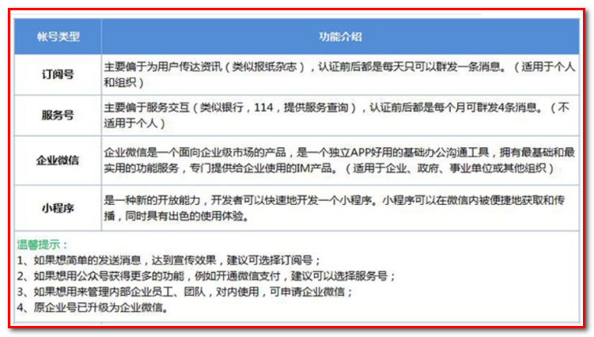 

本项目会选择订阅号这种方式进行公众号开发。

### 8.2.2. **注册帐号**

要开发微信公众号，首先需要注册成为会员，然后就可以登录微信公众平台进行自定义菜单的设置。

注册页面：<https://mp.weixin.qq.com/cgi-bin/registermidpage?action=index&lang=zh_CN&token=>

 

选择订阅号进行注册：

使用邮箱注册。

 

输入邮箱、邮箱验证码、密码、确认密码等按照页面流程进行注册

### 8.2.3. **自定义菜单**

注册成功后就可以使用注册的邮箱和设置的密码进行登录，登录成功后点击左侧“自定义菜单”进入自定义菜单页面

 

在自定义菜单页面可以根据需求创建一级菜单和二级菜单，其中一级菜单最多可以创建3个，每个一级菜单下面最多可以创建5个二级菜单。每个菜单由菜单名称和菜单内容组成，其中菜单内容有3种形式：发送消息（视频、语言、文字、图片）、跳转网页、跳转小程序。

跳转页面：<http://www.helloitcast.xin/>

 

关注微信公众号

1：搜索黑马健康

  

### 8.2.4. 上线要求（了解）

如果是个人用户身份注册的订阅号，则自定义菜单的菜单内容不能进行跳转网页，因为个人用户目前不支持微信认证，而跳转网页需要微信认证之后才有权限。

如果是企业用户，首先需要进行微信认证，通过后就可以进行跳转网页了，跳转网页的地址要求必须有域名并且域名需要备案通过。


### 【小结】

1. 注册的是订阅号 个人的。
   * 公众号，不要选到小程序（身份号码只用到一种，要么小程序，要么公众号）
   * 自定菜单（企业：跳转网页(url:http://xxx.com, xxx域名要备案（企业）-1500。 把项目布署上去)
     * 项目公网布署 
       * 要ECS服务器（华为、腾讯、阿里、、、)  要布署项目的, Centos7，mysql,tomcat, jdk
       * 申请域名, 域名解析（域名映射服务器的ip地址）
       * ECS服务开放安全设置（mysql端口（改）, 80端口，进出站）
       * 域名备案（企业资料，15个工作日，找平台人做）最长30天的时间可以访问，过后会封网站。快的一个星期内就给封
     * 也有一海外服务器是不需要备案.....
2. 上线要求
   - 企业认证
   - 设置菜单的网址需要域名备案

