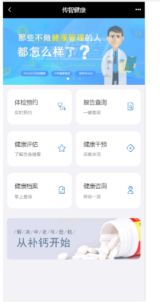
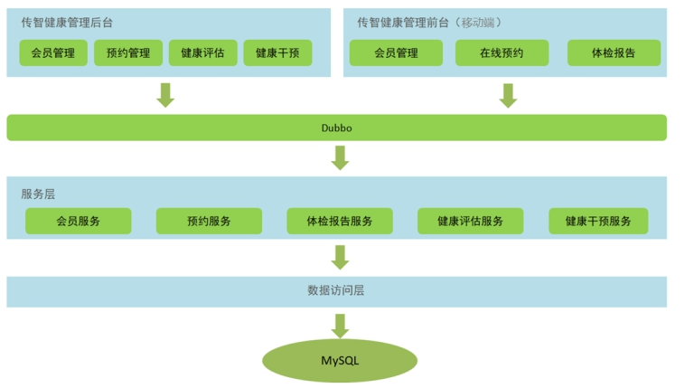
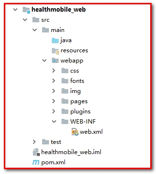
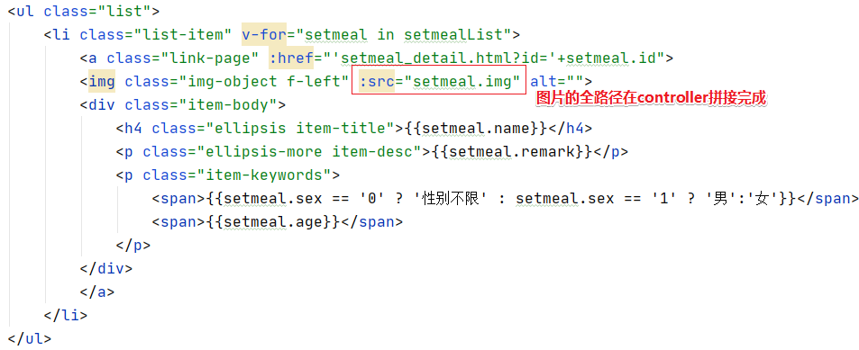
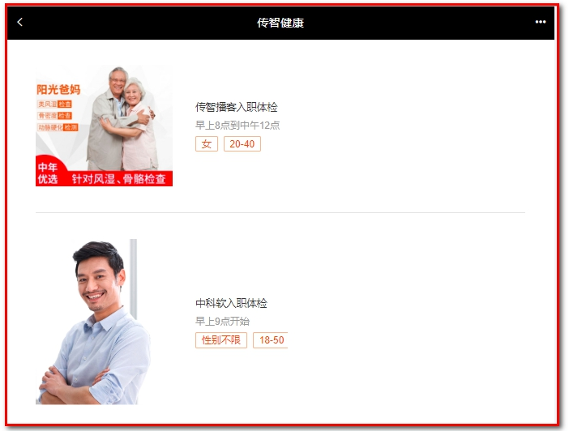
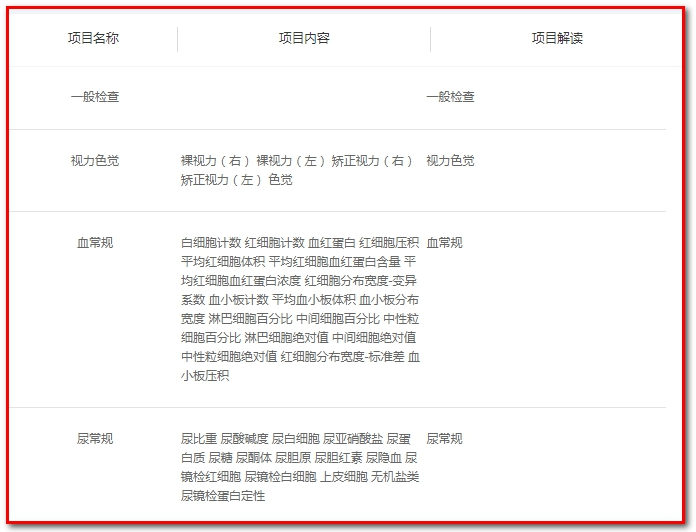

# 第5章 移动端开发-套餐列表、套餐详情、页面静态化

学习目标：

- 掌握移动端套餐列表页动态展示实现过程

- 掌握移动端套餐详情页

- 掌握Freemarker页面静态化技术

- 能够使用Freemarker生成html静态页面


# 1. 移动端需求分析和环境搭建

## 1.1. **需求分析**

### 【目标】

- 能够搭建移动端开发环境

### 【路径】

- 开发需求
- 环境搭建

### 【讲解】

### 1.1.1 移动端开发需求分析

用户在体检之前需要进行预约，可以通过电话方式进行预约，此时会由体检中心客服人员通过后台系统录入预约信息。用户也可以通过手机端自助预约。本章节开发的功能为用户通过手机自助预约。

预约流程如下：

1、访问移动端首页

2、点击体检预约进入体检套餐列表页面

3、在体检套餐列表页面点击具体套餐进入套餐详情页面

4、在套餐详情页面点击立即预约进入预约页面

5、在预约页面录入体检人相关信息点击提交预约

效果如下图：

 

 

 

 

### 【小结】

体检预约-->套餐列表-->套餐详情-->立即预约（发送手机验证码+Redis）

## 1.2. **搭建移动端工程**(互联用户)

### 【目标】

移动端工程搭建

### 【路径】

1. 创建health_mobile工程, 导入坐标(依赖health_interface)
2. 导入页面
3. 配置web.xml（springmvc的核心控制器+post请求乱码过滤器）
4. 创建springmvc.xml(配置dubbo, 驱动注解)
5. 导入通用组件

### 【讲解】

本项目是基于SOA架构进行开发，前面我们已经完成了后台系统的部分功能开发，在后台系统中都是通过Dubbo调用服务层发布的服务进行相关的操作。本章节我们开发移动端工程也是同样的模式，所以我们也需要在移动端工程中通过Dubbo调用服务层发布的服务，如下图：

 

### 1.2.1. **导入maven坐标**

在health_parent工程的pom.xml文件中导入阿里短信发送的maven坐标

```xml
<!--阿里云服务器短信平台-->
<dependency>
    <groupId>com.aliyun</groupId>
    <artifactId>aliyun-java-sdk-core</artifactId>
    <version>3.3.1</version>
</dependency>
<dependency>
    <groupId>com.aliyun</groupId>
    <artifactId>aliyun-java-sdk-dysmsapi</artifactId>
    <version>1.0.0</version>
</dependency>
```

 在health_common工程中添加引入的依赖

```xml
<dependency>
    <groupId>com.aliyun</groupId>
    <artifactId>aliyun-java-sdk-core</artifactId>
</dependency>
<dependency>
    <groupId>com.aliyun</groupId>
    <artifactId>aliyun-java-sdk-dysmsapi</artifactId>
</dependency>
```

### 1.2.2. health_mobile

【路径】

1：pom.xml

2：静态资源（CSS、html、img等）

3：web.xml

4：springmvc.xml

5：spring-jedis.xml

6：redis.properties

7：log4j.properties

移动端工程，打包方式为war，用于存放Controller，在Controller中通过Dubbo可以远程访问服务层相关服务，所以需要依赖health_interface接口工程。

 

#### 1.2.2.1. pom.xml

```xml
<?xml version="1.0" encoding="UTF-8"?>
<project xmlns="http://maven.apache.org/POM/4.0.0"
         xmlns:xsi="http://www.w3.org/2001/XMLSchema-instance"
         xsi:schemaLocation="http://maven.apache.org/POM/4.0.0 http://maven.apache.org/xsd/maven-4.0.0.xsd">
    <parent>
        <artifactId>health_parent</artifactId>
        <groupId>com.itheima</groupId>
        <version>1.0-SNAPSHOT</version>
    </parent>
    <modelVersion>4.0.0</modelVersion>

    <artifactId>health_mobile</artifactId>
     <properties>
          <project.build.sourceEncoding>UTF-8</project.build.sourceEncoding>
          <maven.compiler.source>1.8</maven.compiler.source>
          <maven.compiler.target>1.8</maven.compiler.target>
      </properties>

    <packaging>war</packaging>
    <dependencies>
        <dependency>
            <groupId>com.itheima</groupId>
            <artifactId>health_interface</artifactId>
            <version>1.0-SNAPSHOT</version>
        </dependency>
    </dependencies>
</project>
```

 

#### 1.2.2.2.静态资源（CSS、html、img等，详见资料）

 

 

#### 1.2.2.3. web.xml

```xml
<?xml version="1.0" encoding="UTF-8"?>
<web-app xmlns:xsi="http://www.w3.org/2001/XMLSchema-instance"
         xmlns="http://java.sun.com/xml/ns/javaee"
         xsi:schemaLocation="http://java.sun.com/xml/ns/javaee http://java.sun.com/xml/ns/javaee/web-app_3_0.xsd"
         id="WebApp_ID" version="3.0">
    <display-name>Archetype Created Web Application</display-name>
    <!-- 解决post乱码 -->
    <filter>
        <filter-name>CharacterEncodingFilter</filter-name>
        <filter-class>org.springframework.web.filter.CharacterEncodingFilter</filter-class>
        <init-param>
            <param-name>encoding</param-name>
            <param-value>utf-8</param-value>
        </init-param>
    </filter>
    <filter-mapping>
        <filter-name>CharacterEncodingFilter</filter-name>
        <url-pattern>/*</url-pattern>
    </filter-mapping>
    <servlet>
        <servlet-name>springmvc</servlet-name>
        <servlet-class>org.springframework.web.servlet.DispatcherServlet</servlet-class>
        <!-- 指定加载的配置文件 ，通过参数contextConfigLocation加载 -->
        <init-param>
            <param-name>contextConfigLocation</param-name>
            <param-value>classpath:springmvc.xml</param-value>
        </init-param>
        <load-on-startup>1</load-on-startup>
    </servlet>
    <servlet-mapping>
        <servlet-name>springmvc</servlet-name>
        <url-pattern>*.do</url-pattern>
    </servlet-mapping>
</web-app>
```

 

#### 1.2.2.4. springmvc.xml

```xml
<?xml version="1.0" encoding="UTF-8"?>
<beans xmlns="http://www.springframework.org/schema/beans"
       xmlns:xsi="http://www.w3.org/2001/XMLSchema-instance" xmlns:mvc="http://www.springframework.org/schema/mvc"
       xmlns:dubbo="http://code.alibabatech.com/schema/dubbo"
       xsi:schemaLocation="http://www.springframework.org/schema/beans http://www.springframework.org/schema/beans/spring-beans.xsd http://www.springframework.org/schema/mvc http://www.springframework.org/schema/mvc/spring-mvc.xsd http://code.alibabatech.com/schema/dubbo http://code.alibabatech.com/schema/dubbo/dubbo.xsd">

    <mvc:annotation-driven>
        <mvc:message-converters register-defaults="true">
            <bean class="com.alibaba.fastjson.support.spring.FastJsonHttpMessageConverter">
                <property name="supportedMediaTypes" value="application/json"/>
                <property name="features">
                    <list>
                        <value>WriteMapNullValue</value>
                        <value>WriteDateUseDateFormat</value>
                    </list>
                </property>
            </bean>
        </mvc:message-converters>
    </mvc:annotation-driven>
    <!-- 指定应用名称 -->
    <dubbo:application name="health_mobile" />
    <!--指定服务注册中心地址-->
    <dubbo:registry address="zookeeper://127.0.0.1:2181"/>
    <!--批量扫描-->
    <dubbo:annotation package="com.itheima.health.controller" />
    <!--
        超时全局设置 10分钟
        check=false 不检查服务提供方，开发阶段建议设置为false
        check=true 启动时检查服务提供方，如果服务提供方没有启动则报错
    -->
    <dubbo:consumer timeout="600000" check="false"/>
    <import resource="spring-jedis.xml"></import>
</beans>
```

 

#### 1.2.2.5.spring-jedis.xml：

```xml
<?xml version="1.0" encoding="UTF-8"?>
<beans xmlns="http://www.springframework.org/schema/beans"
       xmlns:xsi="http://www.w3.org/2001/XMLSchema-instance"
       xmlns:context="http://www.springframework.org/schema/context"
       xsi:schemaLocation="http://www.springframework.org/schema/beans http://www.springframework.org/schema/beans/spring-beans.xsd http://www.springframework.org/schema/context http://www.springframework.org/schema/context/spring-context.xsd">

    <context:property-placeholder location="classpath:redis.properties" />

    <!--Jedis连接池的相关配置-->
    <bean id="jedisPoolConfig" class="redis.clients.jedis.JedisPoolConfig">
        <property name="maxTotal">
            <value>${redis.pool.maxActive}</value>
        </property>
        <property name="maxIdle">
            <value>${redis.pool.maxIdle}</value>
        </property>
        <property name="testOnBorrow" value="true"/>
        <property name="testOnReturn" value="true"/>
    </bean>

    <bean id="jedisPool" class="redis.clients.jedis.JedisPool">
        <constructor-arg name="poolConfig" ref="jedisPoolConfig" />
        <constructor-arg name="host" value="${redis.host}" />
        <constructor-arg name="port" value="${redis.port}" type="int" />
        <constructor-arg name="timeout" value="${redis.timeout}" type="int" />
    </bean>
</beans>
```

 

#### 1.2.2.6. redis.properties

```properties
#最大分配的对象数
redis.pool.maxActive=200
#最大能够保持idel状态的对象数
redis.pool.maxIdle=50
redis.pool.minIdle=10
redis.pool.maxWaitMillis=20000
#当池内没有返回对象时，最大等待时间
redis.pool.maxWait=300

#格式：redis://:[密码]@[服务器地址]:[端口]/[db index]
#redis.uri = redis://:12345@127.0.0.1:6379/0

redis.host = 127.0.0.1
redis.port = 6379
redis.timeout = 30000
```

#### 1.2.2.7. log4j.properties

```properties
### direct log messages to stdout ###
log4j.appender.stdout=org.apache.log4j.ConsoleAppender
log4j.appender.stdout.Target=System.err
log4j.appender.stdout.layout=org.apache.log4j.PatternLayout
log4j.appender.stdout.layout.ConversionPattern=%d{ABSOLUTE} %5p %c{1}:%L - %m%n

### direct messages to file mylog.log ###
log4j.appender.file=org.apache.log4j.FileAppender
log4j.appender.file.File=c:\\mylog.log
log4j.appender.file.layout=org.apache.log4j.PatternLayout
log4j.appender.file.layout.ConversionPattern=%d{ABSOLUTE} %5p %c{1}:%L - %m%n

### set log levels - for more verbose logging change 'info' to 'debug' ###

log4j.rootLogger=debug, stdout
```

###  1.2.3. **导入通用组件**

【路径】

1：ValidateCodeUtils工具类：（产生验证码）

2：SMSUtils工具类：（短信服务，用于发送短消息服务（SMS））

3：RedisMessageConstant常量类：

【讲解】

在health_common工程中导入如下通用组件

1：ValidateCodeUtils工具类：（产生验证码）

```java
package com.itheima.health.utils;

import java.util.Random;

/**
 * 随机生成验证码工具类
 */
public class ValidateCodeUtils {
    /**
     * 随机生成验证码
     * @param length 长度为4位或者6位
     * @return
     */
    public static Integer generateValidateCode(int length){
        Integer code =null;
        if(length == 4){
            code = new Random().nextInt(9999);//生成随机数，最大为9999
            if(code < 1000){
                code = code + 1000;//保证随机数为4位数字
            }
        }else if(length == 6){
            code = new Random().nextInt(999999);//生成随机数，最大为999999
            if(code < 100000){
                code = code + 100000;//保证随机数为6位数字
            }
        }else{
            throw new RuntimeException("只能生成4位或6位数字验证码");
        }
        return code;
    }

    /**
     * 随机生成指定长度字符串验证码
     * @param length 长度
     * @return
     */
    public static String generateValidateCode4String(int length){
        Random rdm = new Random();
        String hash1 = Integer.toHexString(rdm.nextInt());
        String capstr = hash1.substring(0, length);
        return capstr;
    }
}
```

 

2：SMSUtils工具类：（短信服务，用于发送短消息服务（SMS））

```java
package com.itheima.health.utils;

import com.aliyuncs.DefaultAcsClient;
import com.aliyuncs.IAcsClient;
import com.aliyuncs.dysmsapi.model.v20170525.SendSmsRequest;
import com.aliyuncs.dysmsapi.model.v20170525.SendSmsResponse;
import com.aliyuncs.exceptions.ClientException;
import com.aliyuncs.http.MethodType;
import com.aliyuncs.profile.DefaultProfile;
import com.aliyuncs.profile.IClientProfile;

/**
 * 短信发送工具类
 */
public class SMSUtils {
	public static final String VALIDATE_CODE = "SMS_189616640";//发送短信验证码
	public static final String ORDER_NOTICE = "SMS_159771588";//体检预约成功通知
	private static final String SIGN_NAEM = "黑马程序员";// 短信的签名
	private static final String PARAMETER_NAME="code";
	private static final String ACCESS_KEY="LTAI4GERJj7v71F3FKjw3z2A"; //你的AccessKey ID
	private static final String SECRET_KEY="dIVZnHGdUTYbqOKMlxZ7R7jXVcnPoz"; //你的AccessKey Secret

	public static void main(String[] args) throws ClientException {
		SMSUtils.sendShortMessage(VALIDATE_CODE,"13652431027","666666");
	}

	/**
	 * 发送短信
	 * @param phoneNumbers
	 * @param param
	 * @throws ClientException
	 */
	public static void sendShortMessage(String templateCode,String phoneNumbers,String param) throws ClientException{
		// 设置超时时间-可自行调整
		System.setProperty("sun.net.client.defaultConnectTimeout", "10000");
		System.setProperty("sun.net.client.defaultReadTimeout", "10000");
		// 初始化ascClient需要的几个参数
		final String product = "Dysmsapi";// 短信API产品名称（短信产品名固定，无需修改）
		final String domain = "dysmsapi.aliyuncs.com";// 短信API产品域名（接口地址固定，无需修改）
		// 替换成你的AK
		final String accessKeyId = "LTAIak3CfAehK7cE";// 你的accessKeyId,参考本文档步骤2
		final String accessKeySecret = "zsykwhTIFa48f8fFdU06GOKjHWHel4";// 你的accessKeySecret，参考本文档步骤2
		// 初始化ascClient,暂时不支持多region（请勿修改）
		IClientProfile profile = DefaultProfile.getProfile("cn-hangzhou", ACCESS_KEY, SECRET_KEY);
		DefaultProfile.addEndpoint("cn-hangzhou", "cn-hangzhou", product, domain);
		IAcsClient acsClient = new DefaultAcsClient(profile);
		// 组装请求对象
		SendSmsRequest request = new SendSmsRequest();
		// 使用post提交
		request.setMethod(MethodType.POST);
		// 必填:待发送手机号。支持以逗号分隔的形式进行批量调用，批量上限为1000个手机号码,批量调用相对于单条调用及时性稍有延迟,验证码类型的短信推荐使用单条调用的方式
		request.setPhoneNumbers(phoneNumbers);
		// 必填:短信签名-可在短信控制台中找到
		request.setSignName(SIGN_NAEM);
		// 必填:短信模板-可在短信控制台中找到
		request.setTemplateCode(templateCode);
		// 可选:模板中的变量替换JSON串,如模板内容为"亲爱的${name},您的验证码为${code}"时,此处的值为
		// 友情提示:如果JSON中需要带换行符,请参照标准的JSON协议对换行符的要求,比如短信内容中包含\r\n的情况在JSON中需要表示成\\r\\n,否则会导致JSON在服务端解析失败
		//request.setTemplateParam("{\"code\":\""+param+"\"}");
		request.setTemplateParam(String.format("{\"%s\":\"%s\"}",PARAMETER_NAME,param));
		// 可选-上行短信扩展码(扩展码字段控制在7位或以下，无特殊需求用户请忽略此字段)
		// request.setSmsUpExtendCode("90997");
		// 可选:outId为提供给业务方扩展字段,最终在短信回执消息中将此值带回给调用者
		// request.setOutId("yourOutId");
		// 请求失败这里会抛ClientException异常
		SendSmsResponse sendSmsResponse = acsClient.getAcsResponse(request);
		if (sendSmsResponse.getCode() != null && sendSmsResponse.getCode().equals("OK")) {
			// 请求成功
			System.out.println("请求成功");
		}else{
			System.out.println(sendSmsResponse.getMessage());
		}
	}
}

```

3：RedisMessageConstant常量类：

```java
package com.itheima.health.constant;

public interface RedisMessageConstant {
    static final String SENDTYPE_ORDER = "001";//用于缓存体检预约时发送的验证码
    static final String SENDTYPE_LOGIN = "002";//用于缓存手机号快速登录时发送的验证码
    static final String SENDTYPE_GETPWD = "003";//用于缓存找回密码时发送的验证码
}
```

### 【小结】

步骤：

-->创建工程-->导入坐标-->页面-->配置文件（web.xml、springmvc.xml、spring-jedis.xml）

-->导入通用组件（生成验证码、发送短信工具类、Redis存储常量类）

# 2.套餐列表页面动态展示

### 【目标】

实现套餐列表功能

访问：首页http://localhost:80

点击“体检预约”，跳转到“套餐列表”页面

 

### 【路径】

1：前台代码编写

1. 在/pages/setmeal.html , 在mounted()钩子函数里面

```
完成需求：
1.使用axios请求服务器, 获得数据 进行模型绑定
2.数据遍历(v-for)
```

2：后台代码编写

​    1.创建类SetmealMobileController.java ，添加查询所有的方法

​	拼接完整的图片路径

2. SetmealService与实现类添加查询所有的方法
3. SetmealDao与映射文件  添加查询所有的方法

```
完成需求：
1：查询所有的套餐
```

### 【讲解-需求】

移动端首页为/pages/index.html，效果如下：

（1）在web.xml中配置：

 

（2）访问：首页http://localhost:80

 

（3）点击体检预约直接跳转到体检套餐列表页面（/pages/setmeal.html）

```html
<a href="/pages/setmeal.html" class="link-page">
    <div class="type-title">
        <h3>体检预约</h3>
        <p>实时预约</p>
    </div>
    <div class="type-icon">
        <i class="icon-zhen">
            <span class="path1"></span><span class="path2"></span>
        </i>
    </div>
</a>
```

 

## 2.1. 前台代码

### 2.1.1. **展示套餐信息**

（1）setmeal.html，遍历v-for="setmeal in setmealList"

 


### 2.1.2. **获取套餐列表数据**

```html
<script>
    var vue = new Vue({
        el:'#app',
        data:{
            setmealList:[] // 套餐列表数据
        },
        // 挂载后
        mounted (){
            axios.get("/setmeal/getSetmeal.do").then((response)=>{
                if(response.data.flag){
                    this.setmealList = response.data.data;
                }else{
                    // 失败的提示
                    alert(response.data.message);
                }
            });
        }
    });
</script>
```

mounted钩子和created钩子

mounted钩子：页面被初始化后执行

created钩子：vue模型被初始化后执行

mounted钩子是在created钩子后面执行的。

## 2.2. **后台代码**

### 2.2.1. **Controller**

在healthmobile_web工程中创建SetmealMobileController并提供getSetmeal方法，在此方法中通过Dubbo远程调用套餐服务获取套餐列表数据

```java
package com.itheima.health.controller;

import com.alibaba.dubbo.config.annotation.Reference;
import com.itheima.health.constant.MessageConstant;
import com.itheima.health.entity.Result;
import com.itheima.health.pojo.Setmeal;
import com.itheima.health.service.SetmealService;
import com.itheima.health.utils.QiNiuUtils;
import org.springframework.web.bind.annotation.GetMapping;
import org.springframework.web.bind.annotation.RequestMapping;
import org.springframework.web.bind.annotation.RestController;

import java.util.List;

/**
 * Description: No Description
 * User: Eric
 */
@RestController
@RequestMapping("/setmeal")
public class SetmealMobileController {

    @Reference
    private SetmealService setmealService;

    /**
     * 查询所有
     */
    @GetMapping("/getSetmeal")
    public Result getSetmeal(){
        // 查询所有的套餐
        List<Setmeal> list = setmealService.findAll();
        // 套餐里有图片有全路径吗? 拼接全路径
        list.forEach(s->{
            s.setImg(QiNiuUtils.DOMAIN + s.getImg());
        });
        return new Result(true, MessageConstant.GET_SETMEAL_LIST_SUCCESS,list);
    }
}

```


### 2.2.2. **服务接口**

在SetmealService服务接口中扩展findAll方法

```java
/**
 * 查询所有
 * @return
 */
List<Setmeal> findAll();
```

 

### 2.2.3. **服务实现类**

在SetmealServiceImpl服务实现类中实现findAll方法

```java
/**
 * 查询所有的套餐
 * @return
 */
@Override
public List<Setmeal> findAll() {
    return setmealDao.findAll();
}
```

 

### 2.2.4. **Dao接口**

在SetmealDao接口中扩展findAll方法

```java
/**
 * 查询所有的套餐
 * @return
 */
List<Setmeal> findAll();
```

 

### 2.2.5. **Mapper映射文件**

在SetmealDao.xml映射文件中扩展SQL语句

```html
<!--查询所有-->
<select id="findAll" resultType="setmeal">
    select * from t_setmeal
</select>
```

查看效果

 

### 【小结】

套餐列表功能需要展示发布的所有套餐，用于体检人选择指定套餐。

从数据查询出来的套餐信息的图片只有图片名称，没有全路径，在Controller返回之前，设置完整的路径

# 3. 套餐详情页面动态展示

### 【目标】

套餐详情页面动态展示


在套餐详情页面需要展示当前套餐的信息（包括图片、套餐名称、套餐介绍、适用性别、适用年龄）、此套餐包含的检查组信息、检查组包含的检查项信息等。

### 【路径】

前台代码编写

1. 在/pages/setmeal_detail.html 

```
完成需求：
1.获取请求参数中套餐id的值
2.获取套餐详细信息
3.展示套餐信息（套餐信息、检查组集合、检查项集合）
```

后台代码编写

​    1.类SetmealMobileController.java

​    2.类SetmealService.java

​    3.类SetmealServiceImpl.java

​    4.类SetmealDao.java

​       类CheckGroupDao

​       类CheckItemDao

​    5.配置文件SetmealDao.xml

​       配置文件CheckGroupDao.xml

​       配置文件CheckItemDao.xml

```
完成需求：
1：根据套餐id查询对应的套餐信息
2：查询每个套餐对应的检查组集合
3：查询每个检查组对应的检查项集合
```

### 【讲解-需求】

前面我们已经完成了体检套餐列表页面动态展示，点击其中任意一个套餐则跳转到对应的套餐详情页面（/pages/setmeal_detail.html），并且会携带此套餐的id作为参数提交。

 

请求路径格式：<http://localhost/pages/setmeal_detail.html?id=10>

在套餐详情页面需要展示当前套餐的信息（包括图片、套餐名称、套餐介绍、适用性别、适用年龄）、此套餐包含的检查组信息、检查组包含的检查项信息等。


## 3.1. 前台代码

### 3.1.1. **获取请求参数中套餐id**

（1）在页面中已经引入了healthmobile.js文件，此文件中已经封装了getUrlParam方法可以根据URL请求路径中的参数名获取对应的值

```javascript
//获取指定的URL参数值 http://localhost/pages/setmeal_detail.html?id=15
// 从url中获取参数的值
function getUrlParam(paraName) {
    var url = document.location.toString();
    //http://localhost/pages/setmeal_detail.html?id=15
    //alert(url);
    var arrObj = url.split("?");
    // arrObj[0]=http://localhost/pages/setmeal_detail.html
    // arrObj[1]=id=15
    if (arrObj.length > 1) {
        //id=15
        var arrPara = arrObj[1].split("&");
        var arr;
        //arrPara[0] id=15
        for (var i = 0; i < arrPara.length; i++) {
            // id=15
            arr = arrPara[i].split("=");
            //arr[0]=id arr[1]=15
            if (arr != null && arr[0] == paraName) {
                return arr[1];
            }
        }
        return "";
    }
    else {
        return "";
    }
}
```

 

（2）在setmeal_detail.html中调用上面定义的方法获取套餐id的值

 


### 3.1.2. **获取套餐详细信息**

```html
<script>
    var vue = new Vue({
        el:'#app',
        data:{
            setmeal:{}
        },
        methods:{
            toOrderInfo(){
                window.location.href = "orderInfo.html?id=" + id;
            }
        },
        mounted(){
            // 获取套餐详情信息
            axios.get("/setmeal/findDetailById.do?id=" + id).then((response) => {
                if(response.data.flag){
                    this.setmeal = response.data.data;
                }
            });
        }
    });
</script>
```


其中：imgUrl要指定七牛云的空间地址

### 3.1.3. 展示套餐信息

1：{{setmeal.name}}：套餐信息

2：v-for="checkgroup in setmeal.checkGroups：检查组信息

3：v-for="checkitem in checkgroup.checkItems"：检查项信息

套餐图片的展示

 

```html
<!-- 页面内容 -->
<div class="contentBox">
    <div class="card">
        <div class="project-img">
            
        </div>
        <div class="project-text">
            <h4 class="tit">{{setmeal.name}}</h4>
            <p class="subtit">{{setmeal.remark}}</p>
            <p class="keywords">
                <span>{{setmeal.sex == '0' ? '性别不限' : setmeal.sex == '1' ? '男':'女'}}</span>
                <span>{{setmeal.age}}</span>
            </p>
        </div>
    </div>
    <div class="table-listbox">
        <div class="box-title">
            <i class="icon-zhen"><span class="path1"></span><span class="path2"></span></i>
            <span>套餐详情</span>
        </div>
        <div class="box-table">
            <div class="table-title">
                <div class="tit-item flex2">项目名称</div>
                <div class="tit-item  flex3">项目内容</div>
                <div class="tit-item  flex3">项目解读</div>
            </div>
            <div class="table-content">
                <ul class="table-list">
                    <li class="table-item" v-for="checkgroup in setmeal.checkGroups">
                        <div class="item flex2">{{checkgroup.name}}</div>
                        <div class="item flex3">
                            <label v-for="checkitem in checkgroup.checkItems">
                                {{checkitem.name}}
                            </label>
                        </div>
                        <div class="item flex3">{{checkgroup.remark}}</div>
                    </li>
                </ul>
            </div>
            <div class="box-button">
                <a @click="toOrderInfo()" class="order-btn">立即预约</a>
            </div>
        </div>
    </div>
</div>
```

 

## 3.2. **后台代码**

### 3.2.1. **Controller**

在SetmealMobileController中提供findById方法

```java
/**
 * 查询套餐详情
 */
@GetMapping("/findDetailById")
public Result findDetailById(int id){
    // 调用服务查询详情
    Setmeal setmeal = setmealService.findDetailById(id);
    // 设置图片的完整路径
    setmeal.setImg(QiNiuUtils.DOMAIN + setmeal.getImg());
    return new Result(true, MessageConstant.QUERY_SETMEAL_SUCCESS,setmeal);
}
```

 

### 3.2.2. **服务接口**

在SetmealService服务接口中提供findById方法

```java
/**
 * 查询套餐详情
 * @param id
 * @return
 */
Setmeal findDetailById(int id);
```

### 3.2.3. **服务实现类**

在SetmealServiceImpl服务实现类中实现findById方法

```java
/**
 * 查询套餐详情
 * @param id
 * @return
 */
@Override
public Setmeal findDetailById(int id) {
    return setmealDao.findDetailById(id);
}
```

 

### 3.2.4. **Dao接口**

1：在SetmealDao接口中提供findById方法

```java
/**
 * 查询套餐详情
 * @param id
 * @return
 */
Setmeal findDetailById(int id);
```


### 3.2.5. **Mapper映射文件**

此处会使用mybatis提供的关联查询，在根据id查询套餐时，同时将此套餐包含的检查组都查询出来，并且将检查组包含的检查项都查询出来。

1：SetmealDao.xml文件：

```xml
<select id="findDetailById" parameterType="int" resultMap="setmealDetailMap">
    select
        s.*,
        sg.checkgroup_id, cg.name checkgroup_name, cg.remark as checkgroup_remark,
        cc.checkitem_id, ci.name checkitem_name
    From
        t_setmeal s, t_setmeal_checkgroup sg,
        t_checkgroup cg, t_checkgroup_checkitem cc,
        t_checkitem ci
    where
        s.id=sg.setmeal_id and sg.checkgroup_id=cg.id
        and cg.id=cc.checkgroup_id and cc.checkitem_id=ci.id
        and s.id=#{id}
</select>
<!--  
1对多关系配置
套餐下有检查组
检查组下有检查项
-->
<resultMap id="setmealDetailMap" type="setmeal">
    <id property="id" column="id"/>
    <result property="name" column="name" />
    <result property="code" column="code" />
    <result property="helpCode" column="helpCode" />
    <result property="sex" column="sex" />
    <result property="age" column="age" />
    <result property="price" column="price" />
    <result property="remark" column="remark" />
    <result property="attention" column="attention" />
    <result property="img" column="img" />
    <collection property="checkGroups" ofType="CheckGroup">
        <id property="id" column="checkgroup_id"/>
        <result property="name" column="checkgroup_name"/>
        <result property="remark" column="checkgroup_remark"/>
        <collection property="checkItems" ofType="CheckItem">
            <id property="id" column="checkitem_id"/>
            <result property="name" column="checkitem_name"/>
        </collection>
    </collection>
</resultMap>

```

测试效果：

 

 

### 【小结】

```
1：掌握sql语句的联合查询（sql语句的嵌套查询），应用在多对多场景
2：掌握使用<resultMap>完成映射
3：掌握使用<collection> 1对多 完成集合的封装（<association> 1对1 完成对象的封装）
```


### 套餐详情实现-方式二

1 页面修改

 

2 SetmealMobileController 添加方式二的方法

```java
/**
 * 查询套餐详情
 */
@GetMapping("/findDetailById2")
public Result findDetailById2(int id){
    // 调用服务查询详情
    Setmeal setmeal = setmealService.findDetailById2(id);
    // 设置图片的完整路径
    setmeal.setImg(QiNiuUtils.DOMAIN + setmeal.getImg());
    return new Result(true, MessageConstant.QUERY_SETMEAL_SUCCESS,setmeal);
}
```


3 SetmealService接口与实现类

SetmealService添加方法

```java
/**
 * 查询套餐详情
 * @param id
 * @return
 */
Setmeal findDetailById2(int id);
```

SetmealServiceImp 添加实现

```java
/**
 * 查询套餐详情
 * @param id
 * @return
 */
@Override
public Setmeal findDetailById2(int id) {
    return setmealDao.findDetailById2(id);
}
```


3 SetmealDao与映射文件

SetmealDao添加方法

```java
/**
 * 查询套餐详情 方式二
 * @param id
 * @return
 */
Setmeal findDetailById2(int id);
```

映射文件

```xml
<!-- SetmealDao.xml -->
<select id="findDetailById2" resultMap="setmealResultMap">
    select * from t_setmeal where id=#{id}
</select>

<resultMap type="Setmeal" id="setmealResultMap">
    <id column="id" property="id"/>
    <result column="name" property="name"/>
    <result column="code" property="code"/>
    <result column="helpCode" property="helpCode"/>
    <result column="sex" property="sex"/>
    <result column="age" property="age"/>
    <result column="price" property="price"/>
    <result column="remark" property="remark"/>
    <result column="attention" property="attention"/>
    <result column="img" property="img"/>
    <collection property="checkGroups" column="id"
                select="com.itheima.health.dao.CheckGroupDao.findCheckGroupListById">
    </collection>
</resultMap>

<!-- CheckGroupDao.xml -->
<resultMap type="com.itheima.health.pojo.CheckGroup" id="findByIdResultMap">
    <id column="id" property="id"/>
    <result column="name" property="name"/>
    <result column="code" property="code"/>
    <result column="helpCode" property="helpCode"/>
    <result column="sex" property="sex"/>
    <result column="remark" property="remark"/>
    <result column="attention" property="attention"/>
    <collection property="checkItems" column="id"
                select="com.itheima.health.dao.CheckItemDao.findCheckItemListById">
    </collection>
</resultMap>
<!--根据套餐id查询检查项信息-->
<select id="findCheckGroupListById" resultMap="findByIdResultMap">
    select * from t_checkgroup  where id
    in (select checkgroup_id from t_setmeal_checkgroup where setmeal_id=#{id})
</select>

<!-- CheckItemDao.xml -->
<!--根据检查组id查询检查项信息-->
<select id="findCheckItemListById" resultType="com.itheima.health.pojo.CheckItem">
    select * from t_checkitem  where id
    in (select checkitem_id from t_checkgroup_checkitem where checkgroup_id=#{id})
</select>
```


### 套餐详情实现-方式三

1 页面修改

 

2 SetmealMobileController

```java
/**
 * 查询套餐详情
 */
@GetMapping("/findDetailById3")
public Result findDetailById3(int id){
    // 调用服务查询详情
    Setmeal setmeal = setmealService.findDetailById3(id);
    // 设置图片的完整路径
    setmeal.setImg(QiNiuUtils.DOMAIN + setmeal.getImg());
    return new Result(true, MessageConstant.QUERY_SETMEAL_SUCCESS,setmeal);
}
```

3 SetmealService接口与实现类

SetmealService接口

```java
/**
 * 查询套餐详情 方式三
 * @param id
 * @return
 */
Setmeal findDetailById3(int id);
```

SetmealServiceImpl实现类

```java
/**
 * 查询套餐详情 方式三
 */
@Override
public Setmeal findDetailById3(int id) {
    // 查询套餐信息
    Setmeal setmeal = setmealDao.findById(id);
    // 查询套餐下的检查组
    List<CheckGroup> checkGroups = setmealDao.findCheckGroupListBySetmealId(id);
    if(null != checkGroups){
        for (CheckGroup checkGroup : checkGroups) {
            // 通过检查组id检查检查项列表
            List<CheckItem> checkItems = setmealDao.findCheckItemByCheckGroupId(checkGroup.getId());
            // 设置这个检查组下所拥有的检查项
            checkGroup.setCheckItems(checkItems);
        }
        //设置套餐下的所拥有的检查组
        setmeal.setCheckGroups(checkGroups);
    }
    return setmeal;
}
```

4 SetmealDao与映射文件

SetmealDao接口

```java
/**
 * 通过套餐id查询检查组列表
 * @param id
 * @return
 */
List<CheckGroup> findCheckGroupListBySetmealId(Integer id);

/**
 * 通过检查组id检查检查项列表
 * @param id
 * @return
 */
List<CheckItem> findCheckItemByCheckGroupId(Integer id);
```

SetmealDao.xml映射文件 

```xml
<select id="findCheckGroupListBySetmealId" resultType="Checkgroup" parameterType="int">
     select * from t_checkgroup where id in (
        select checkgroup_id from t_setmeal_checkgroup where setmeal_id=#{id}
     )
</select>
<select id="findCheckItemByCheckGroupId" resultType="checkitem" parameterType="int">
     select * from t_checkitem where id in (
        select checkitem_id from t_checkgroup_checkitem where checkgroup_id=#{id}
     )
</select>
```

套餐详情方式实现结果：

推荐使用方式一，获取1个连接，查询一次就返回结果

方式二： 获取1个连接，期间需要执行多次查询，查询次数取决于检查组的个数

方式三：每次查询都获取新的连接，查询的次数与方式二一样。


# 4.Freemarker页面静态化技术

### 【目标】

1：什么是页面静态化技术（作用：用于减少查询数据库的频率, 利于SEO 搜索排名靠前）

2：什么是Freemarker

3：Freemarker的操作入门

### 【路径】

1：什么是页面静态化技术（作用：用于减少查询数据库的频率）

2：什么是Freemarker（作用：可生成html静态资源文件，从而达到减少查询数据库的频率）

3：Freemarker入门案例

（1）搭建环境

（2）创建模板文件

（3）使用模板文件，生成静态文件

4：Freemarker相关指令

（1）assign指令

（2）include指令

（3）if指令

（4）list指令

### 【讲解】

## 4.1.  页面静态化介绍

本章课程中我们已经实现了移动端套餐列表页面和套餐详情页面的动态展示。但是我们需要思考一个问题，就是对于这两个页面来说，每次用户访问这两个页面都需要查询数据库获取动态数据进行展示，而且这两个页面的访问量是比较大的，这就对数据库造成了很大的访问压力，并且数据库中的数据变化频率并不高。那我们需要通过什么方法为数据库减压并提高系统运行性能呢？答案就是页面静态化。

页面静态化其实就是将原来的动态网页(例如通过ajax请求动态获取数据库中的数据并展示的网页)改为通过静态化技术生成的静态网页，这样用户在访问网页时，服务器直接给用户响应静态html页面，没有了动态查询数据库的过程。

那么这些静态HTML页面还需要我们自己去编写吗？其实并不需要，我们可以通过专门的页面静态化技术帮我们生成所需的静态HTML页面，例如：Freemarker、thymeleaf, velocity等。


页面静态化技术：  把页面需要所有数据都写死文件里，下次使用时，不需要再去查询数据库，直接用即可

## 4.2.  Freemarker介绍

FreeMarker 是一个用 Java 语言编写的模板引擎，它基于模板来生成文本输出。FreeMarker与 Web 容器无关，即在 Web 运行时，它并不知道 Servlet 或 HTTP。它不仅可以用作表现层的实现技术，而且还可以用于生成 XML，JSP 或 Java 等。


学习网站：<http://freemarker.foofun.cn/>

Freemarker: 是一款文本模板引擎，运行后台代码。 Velocity, Thymeleaf

作用： 实现页面静态化，通过模板来生成文件，往模板填写数据即可

## 4.3.  Freemarker入门案例

### 4.3.1.  环境搭建

创建freemarkdemo工程并导入Freemarker的maven坐标

```xml
<dependency>
  <groupId>org.freemarker</groupId>
  <artifactId>freemarker</artifactId>
  <version>2.3.23</version>
</dependency>
```

### 4.3.2.  创建模板文件

模板文件中有四种元素：

  1、文本，直接输出的部分
  2、注释，即<#--...-->格式不会输出
  3、插值（Interpolation）：即${..}部分,将使用数据模型中的部分替代输出
  4、FTL指令：FreeMarker指令，和HTML标记类似，名字前加#予以区分，不会输出

Freemarker的模板文件后缀可以任意，一般建议为ftl。

在D盘创建ftl目录，在ftl目录中创建名称为test.ftl的模板文件，内容如下：

```html
<html>
<head>
	<meta charset="utf-8">
	<title>Freemarker入门</title>
</head>
<body>
    <#--我只是一个注释，我不会有任何输出  -->
    ${name}你好，${message}
</body>
</html>
```

### 4.3.3.  生成文件

使用步骤：

第一步：创建一个 Configuration 对象，直接 new 一个对象。构造方法的参数就是 freemarker的版本号。

第二步：设置模板文件所在的路径。

第三步：设置模板文件使用的字符集。一般就是 utf-8。

第四步：加载一个模板，创建一个模板对象。

第五步：创建一个模板使用的数据集，可以是 pojo 也可以是 map。一般是 Map。

第六步：创建一个 Writer 对象，一般创建 FileWriter 对象，指定生成的文件名。

第七步：调用模板对象的 process 方法输出文件。

第八步：关闭流。

```java
public static void main(String[] args) throws Exception{
	//1.创建配置类
	Configuration configuration=new Configuration(Configuration.getVersion());
	//2.设置模板所在的目录 
	configuration.setDirectoryForTemplateLoading(new File("D:\\ftl"));
	//3.设置字符集
	configuration.setDefaultEncoding("utf-8");
	//4.加载模板
	Template template = configuration.getTemplate("test.ftl");
	//5.创建数据模型
	Map map=new HashMap();
	map.put("name", "张三");
	map.put("message", "欢迎来到传智播客！");
	//6.创建Writer对象
	Writer out =new FileWriter(new File("d:\\test.html"));
	//7.输出
	template.process(map, out);
	//8.关闭Writer对象
	out.close();
}
```

上面的入门案例中Configuration配置对象是自己创建的，字符集和模板文件所在目录也是在Java代码中指定的。在项目中应用时可以将Configuration对象的创建交由Spring框架来完成，并通过依赖注入方式将字符集和模板所在目录注入进去。

## 4.4.  Freemarker指令

### 4.4.1.  assign指令

assign指令用于在页面上定义一个变量

（1）定义简单类型

```html
<#assign linkman="周先生">
联系人：${linkman}
```

（2）定义对象类型

```html
<#assign info={"mobile":"13812345678",'address':'北京市昌平区'} >
电话：${info.mobile}  地址：${info.address}
```

### 4.4.2.  include指令

include指令用于模板文件的嵌套，  用于页面布局, 页面公共内容的抽取

（1）创建模板文件head.ftl

```html
<h1>黑马程序员</h1>
```

（2）修改入门案例中的ftl.ftl，在ftl.ftl模板文件中使用include指令引入上面的模板文件

```html
<#include "head.ftl"/>
```

### 4.4.3.  if指令

if指令用于判断

（1）在模板文件中使用if指令进行判断

```html
<#if success=true>
  你已通过实名认证
<#else>  
  你未通过实名认证
</#if>
```

（2）在java代码中为success变量赋值

```java
map.put("success", true);
```

在freemarker的判断中，可以使用= 也可以使用

if指令可以配合assign success=true使用

```java
<#assign success1=true>
<#if success1=true>
  你已通过实名认证1
<#else>  
  你未通过实名认证1
</#if>
```


### 4.4.4.  list指令

list指令用于遍历

（1）在模板文件中使用list指令进行遍历

```html
<#list goodsList as goods>
  商品名称： ${goods.name} 价格：${goods.price}<br>
</#list>
```

（2）在java代码中为goodsList赋值

```java
List goodsList=new ArrayList();

Map goods1=new HashMap();
goods1.put("name", "苹果");
goods1.put("price", 5.8);

Map goods2=new HashMap();
goods2.put("name", "香蕉");
goods2.put("price", 2.5);

Map goods3=new HashMap();
goods3.put("name", "橘子");
goods3.put("price", 3.2);

goodsList.add(goods1);
goodsList.add(goods2);
goodsList.add(goods3);

map.put("goodsList", goodsList);

```

### 【小结】

http://freemarker.foofun.cn/ 官方

1：什么是页面静态化技术，返回给浏览器时，所有的数据都已经写好了，不需要再访问服务去获取数据，页面中的内容已经写死了。 减少数据库访问、提高seo

2：什么是Freemarker（作用：可生成html静态资源文件，从而达到减少查询数据库的频率）

是一种模板引擎，通过往模板填充数据即生成文件。

3：Freemarker入门案例

（1）搭建环境 （maven，引入依赖）

（2）创建模板文件(【utf-8】【utf-8】【utf-8】另存为选择utf-8, ANSI->latin-1 -> ISO-8859-1)

（3）使用模板文件(加载文件，配置模板文件目录，设置默认的编码utf-8，获取模板)，生成静态文件(数据模型map)

1. 通过版本来创建配置类
2. 设置模板路径
3. 设置编码
4. 通过文件名获取模板
5. 创建数据模型Map<String,Object> 实体类
6. process方法，填充数据到输出文件里
7. 关闭流

4：Freemarker相关指令

（1）assign指令 声明变量且给它赋值, 如果数据模型中有相同的变量，则以assin有效

（2）include指令 导入其它模板文件，页面布局，公共内容的抽取

（3）if指令（常用） 判断输出

（4）list指令（常用） 遍历集合 list as item

5. 如果数据模型dataModel与assign使用同一变量时，则以assign为准
6. 如果模板中使用了某个变量在dataModel没有定义/没有assign，则会报错
7. 模板中使用的变量不能为null, 否则报错

# 5. 生成移动端静态页面，整合项目

前面我们已经学习了Freemarker的基本使用方法，下面我们就可以将Freemarker应用到项目中，帮我们生成移动端套餐列表静态页面和套餐详情静态页面。接下来我们需要思考几个问题：

（1）什么时候生成静态页面比较合适呢？套餐的增删改(列表, 修改的套餐详情)

（2）将静态页面生成到什么位置呢？   health_mobile/webapp/pages/

（3）应该生成几个静态页面呢？ 套餐列表.html,   setmeal_{id}.html

对于第一个问题，应该是当套餐数据发生改变时，需要生成静态页面，即我们通过后台系统修改套餐数据（包括新增、删除、编辑）时。

对于第二个问题，如果是在开发阶段可以将文件生成到项目工程中，如果上线后可以将文件生成到移动端系统运行的tomcat中。

对于第三个问题，套餐列表只需要一个页面就可以了，在这个页面中展示所有的套餐列表数据即可。套餐详情页面需要有多个，即一个套餐应该对应一个静态页面。

### 【目标】

1：在传智健康前端系统中使用页面静态化Freemarker技术

2：使用Freemarker生成 套餐列表静态化页面 列表页

3：使用Freemarker生成 套餐详情静态化页面  多个，以id区分

4：Freemarker与spring的整合使用 配置文件

### 【路径】

1：环境搭建

2：创建模板文件

（1）mobile_setmeal.ftl

（2）mobile_setmeal_detail.ftl

3：spring整合Freemarker

（1）freemarker.properties

（2）applicationContext-freemarker.xml

4：生成静态页面

生成静态页面的时机，在新增套餐的时候生成静态页面（套餐列表及套餐详情）

### 【讲解】

## 5.1. 环境搭建

在health_parent工程的pom文件中导入Freemarker的maven坐标

 

 

在health_common工程的pom文件中导入Freemarker的maven坐标

```xml
<dependency>
    <groupId>org.freemarker</groupId>
    <artifactId>freemarker</artifactId>
</dependency>
```

## 5.2. 创建模板文件

在health_service工程的WEB-INF目录中创建ftl目录，在ftl目录中创建模板文件mobile_setmeal.ftl和mobile_setmeal_detail.ftl文件，前者是用于生成套餐列表页面的模板文件，后者是生成套餐详情页面的模板文件

（1）mobile_setmeal.ftl

```html
<!DOCTYPE html>
<html lang="zh-CN">
<head>
    <meta charset="utf-8">
    <meta http-equiv="X-UA-Compatible" content="IE=edge">
    <!-- 上述3个meta标签*必须*放在最前面，任何其他内容都*必须*跟随其后！ -->
    <meta name="viewport" content="width=device-width, initial-scale=1.0, maximum-scale=1.0, user-scalable=0,user-scalable=no,minimal-ui">
    <meta name="description" content="">
    <meta name="author" content="">
    <link rel="icon" href="../img/asset-favico.ico">
    <title>预约</title>
    <link rel="stylesheet" href="../css/page-health-order.css" />
</head>
<body data-spy="scroll" data-target="#myNavbar" data-offset="150">
<div class="app" id="app">
    <!-- 页面头部 -->
    <div class="top-header">
        <span class="f-left"><i class="icon-back" onclick="history.go(-1)"></i></span>
        <span class="center">传智健康</span>
        <span class="f-right"><i class="icon-more"></i></span>
    </div>
    <!-- 页面内容 -->
    <div class="contentBox">
        <div class="list-column1">
            <ul class="list">
                <#list setmealList as setmeal>
                <li class="list-item" >
                    <a class="link-page" href="setmeal_${setmeal.id}.html">
                    
                    <div class="item-body">
                        <h4 class="ellipsis item-title">${setmeal.name}</h4>
                        <p class="ellipsis-more item-desc">${setmeal.remark}</p>
                        <p class="item-keywords">
                            <span>
                                <#if setmeal.sex=='0'>
                                    性别不限
                                <#else>
                                    <#if setmeal.sex=='1'>
                                        男
                                    <#else>
                                        女
                                    </#if>
                                </#if>
                            </span>
                            <span>${setmeal.age}</span>
                        </p>
                    </div>
                    </a>
                </li>
                </#list>
            </ul>
        </div>
    </div>
</div>
</body>
```

注意1：上面的数据需保证数据库中不能为null。

注意2： 套餐列表 的值里要设置图片的完整路径。

注意3：上面模板文件中每个套餐对应的超链接如下：

 

可以看到，链接的地址是动态构成的，

如果套餐的id为1，则对应的超链接地址为setmeal_1.html；

如果套餐的id为5，则对应的超链接地址为setmeal_5.html。

所以我们需要为每个套餐生成一个套餐详情静态页面。

（2）mobile_setmeal_detail.ftl

```html
<!DOCTYPE html>
<html lang="zh-CN">
<head>
    <meta charset="utf-8">
    <meta http-equiv="X-UA-Compatible" content="IE=edge">
    <!-- 上述3个meta标签*必须*放在最前面，任何其他内容都*必须*跟随其后！ -->
    <meta name="viewport" content="width=device-width, initial-scale=1.0, maximum-scale=1.0, user-scalable=0,user-scalable=no,minimal-ui">
    <meta name="description" content="">
    <meta name="author" content="">
    <link rel="icon" href="../img/asset-favico.ico">
    <title>预约详情</title>
    <link rel="stylesheet" href="../css/page-health-orderDetail.css" />
</head>
<body data-spy="scroll" data-target="#myNavbar" data-offset="150">
<div id="app" class="app">
    <!-- 页面头部 -->
    <div class="top-header">
        <span class="f-left"><i class="icon-back" onclick="history.go(-1)"></i></span>
        <span class="center">传智健康</span>
        <span class="f-right"><i class="icon-more"></i></span>
    </div>
    <!-- 页面内容 -->
    <div class="contentBox">
        <div class="card">
            <div class="project-img">
                
            </div>
            <div class="project-text">
                <h4 class="tit">${setmeal.name}</h4>
                <p class="subtit">${setmeal.remark}</p>
                <p class="keywords">
                    <span>
                        <#if setmeal.sex=='0'>
                            性别不限
                        <#else>
                            <#if setmeal.sex=='1'>
                                男
                            <#else>
                                女
                            </#if>
                        </#if>
                    </span>
                    <span>${setmeal.age}</span>
                </p>
            </div>
        </div>
        <div class="table-listbox">
            <div class="box-title">
                <i class="icon-zhen"><span class="path1"></span><span class="path2"></span></i>
                <span>套餐详情</span>
            </div>
            <div class="box-table">
                <div class="table-title">
                    <div class="tit-item flex2">项目名称</div>
                    <div class="tit-item  flex3">项目内容</div>
                    <div class="tit-item  flex3">项目解读</div>
                </div>
                <div class="table-content">
                    <ul class="table-list">
                        <#list setmeal.checkGroups as checkgroup>
                        <li class="table-item">
                            <div class="item flex2">${checkgroup.name}</div>
                            <div class="item flex3">
                                <#list checkgroup.checkItems as checkitem>
                                <label>
                                    ${checkitem.name}
                                </label>
                                </#list>
                            </div>
                            <div class="item flex3">${checkgroup.remark}</div>
                        </li>
                        </#list>
                    </ul>
                </div>
                <div class="box-button">
                    <a href="orderInfo.html?id=${setmeal.id}" class="order-btn">立即预约</a>
                </div>
            </div>
        </div>
    </div>
</div>
</body>
```

注意：改变七牛云的访问地址

## 5.3. 配置文件

（1）在health_service 工程中创建属性文件freemarker.properties。这个路径要改你的health_mobile中的webapp/pages目录，全路径

```makefile
out_put_path=D:/ideaProjects/health_parent/health_mobile/src/main/webapp/pages
```

通过上面的配置可以指定将静态HTML页面生成的目录位置

（2）在health_service工程的Spring配置文件中配置，创建applicationContext-freemarker.xml

```xml
<?xml version="1.0" encoding="UTF-8"?>
<beans xmlns="http://www.springframework.org/schema/beans"
       xmlns:xsi="http://www.w3.org/2001/XMLSchema-instance"
       xmlns:context="http://www.springframework.org/schema/context"
       xsi:schemaLocation="http://www.springframework.org/schema/beans http://www.springframework.org/schema/beans/spring-beans.xsd http://www.springframework.org/schema/context http://www.springframework.org/schema/context/spring-context.xsd">

    <context:property-placeholder location="classpath:freemarker.properties"/>
    <bean id="freemarkerConfig"
          class="org.springframework.web.servlet.view.freemarker.FreeMarkerConfigurer">
        <!--指定模板文件所在目录-->
        <property name="templateLoaderPath" value="/WEB-INF/ftl/" />
        <!--指定字符集-->
        <property name="defaultEncoding" value="UTF-8" />
    </bean>
</beans>
```

（3）在applicationContext-service.xml中导入applicationContext-freemarker.xml

 

## 5.4. 生成静态页面

修改health_service_provider工程中的SetmealServiceImpl类的add方法，加入生成静态页面的逻辑。

```java
/**
 * 添加套餐
 * @param setmeal
 * @param checkgroupIds
 */
@Override
@Transactional
public void add(Setmeal setmeal, Integer[] checkgroupIds) {
    // 添加套餐信息
    setmealDao.add(setmeal);
    // 获取套餐的id
    Integer setmealId = setmeal.getId();
    // 添加套餐与检查组的关系
    if(null != checkgroupIds){
        for (Integer checkgroupId : checkgroupIds) {
            setmealDao.addSetmealCheckGroup(setmealId, checkgroupId);
        }
    }
    //新增套餐后需要重新生成静态页面
    generateMobileStaticHtml();
}

/**
 * 生成 列表及详情静态页面
 */
private void generateMobileStaticHtml(){
    try {
        // 套餐列表静态页面
        generateSetmealListHtml();
        // 套餐详情静态页面 生成单就行了，为了测试方便，生成所有的
        generateSetmealDetailHtml();
    } catch (Exception e) {
        throw new RuntimeException(e);
    }
}

/**
 * 生成套餐详情静态页面
 */
private void generateSetmealDetailHtml() throws Exception {
    // 把所有套餐都生成详情页面 方便测试
    List<Setmeal> setmealList = setmealDao.findAll();
    // setmealList中的套餐是没有详情信息，即没有检查组也没有检查项的信息，要查询一遍
    for (Setmeal setmeal : setmealList) {
        // 获取套餐详情
        Setmeal setmealDetail = setmealDao.findDetailById(setmeal.getId());
        // 设置套餐的图片路径
        setmealDetail.setImg(QiNiuUtils.DOMAIN + setmealDetail.getImg());
        // 生成详情页面
        generateDetailHtml(setmealDetail);
    }
}

/**
 * 生成套餐详情页面
 * @param setmealDetail
 */
private void generateDetailHtml(Setmeal setmealDetail) throws Exception {
    // 获取模板 套餐列表的模板
    Template template = freeMarkerConfigurer.getConfiguration().getTemplate("mobile_setmeal_detail.ftl");
    Map<String, Object> dataMap = new HashMap<String,Object>();
    dataMap.put("setmeal", setmealDetail);
    File setmealDetailFile = new File(out_put_path, "setmeal_" + setmealDetail.getId() + ".html");
    template.process(dataMap, new BufferedWriter(new OutputStreamWriter(new FileOutputStream(setmealDetailFile),"utf-8")));
}

/**
 * 生成 套餐列表静态页面
 */
private void generateSetmealListHtml() throws Exception {
    // 获取模板 套餐列表的模板
    Template template = freeMarkerConfigurer.getConfiguration().getTemplate("mobile_setmeal.ftl");
    // 获取数据模型
    List<Setmeal> setmealList = setmealDao.findAll();
    // 图片地址
    setmealList.forEach(s->{
        s.setImg(QiNiuUtils.DOMAIN + s.getImg());
    });
    Map<String, Object> dataMap = new HashMap<String,Object>();
    dataMap.put("setmealList", setmealList);
    // 给模板填充数据 new OutputStreamWriter要指定编码格式，否则中文乱码
    // 生成的文件 c:/sz89/health_parent/health_mobile/src/main/webapp/pages/m_setmeal.html
    File setmealListFile = new File(out_put_path, "m_setmeal.html");
    template.process(dataMap, new BufferedWriter(new OutputStreamWriter(new FileOutputStream(setmealListFile),"utf-8")));
}
```

通过上面代码可以看到，我们生成的套餐列表页面名称为m_setmeal.html，为了能够在移动端访问到此页面，需要将移动端工程中的/pages/index.html页面的超链接地址进行修改：

 

之前为：<a href="/pages/setmeal.html" class="link-page"></a>

修改为：<a href="/pages/m_setmeal.html" class="link-page"></a>


### 【小结】

1：环境搭建 

2：创建模板文件  模板文件的编码一定是utf-8

（1）mobile_setmeal.ftl

（2）mobile_setmeal_detail.ftl

3：spring整合Freemarker

（1）freemarker.properties  生成的文件存储目录

（2）applicationContext-freemarker.xml 整合 defaultEncoding=utf-8

4：生成静态页面

生成静态页面的时机，在新增套餐的时候生成静态页面（套餐列表及套餐详情）

新增时：生成套餐列表页面，生成新的套餐详情页面

修改时：生成套餐列表页面，生成修改的套餐详情页面

删除时：生成套餐列表页面，（生成删除的套餐详情页面（下架, 所有链接要失效, 或者把页面移除）)

布署项目时，要触发一次生成所有的静态页面

应该用后台任务来跑（lastUpdated, 任务表lastUpdate）

new OutputStreamWriter(os, "utf-8")